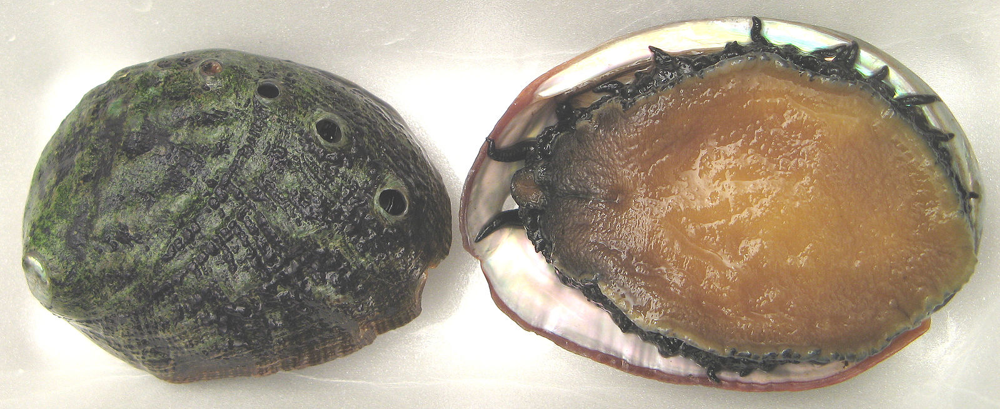

# Lab: Using a FeedForward Network as Classifier

* Abalone data
  * Gender
  * Weight
  * Height etc
* Question for the Neural Network
  * Given that data can we predict age
  * Otherwise age is calculated by killing the abalone and counting rings


------------------
<div style="page-break-after: always;"></div>

# Data Source

* University of California at Irvine
* Large collection of DataSets
  * http://archive.ics.uci.edu/ml/datasets.html
  
------------------
<div style="page-break-after: always;"></div>

# What is an Abalone



<div style="font-size: 30%;" >
Copyright: The original uploader was Geographer at English Wikipedia - Transferred from en.wikipedia to Commons., CC BY-SA 3.0, https://commons.wikimedia.org/w/index.php?curid=4384795
</div>

------------------
<div style="page-break-after: always;"></div>

# More about Abalone

* Tasty Seafood
* High harvest demand needs to be managed
* Populations are studied
* Therefore we have a dataset


------------------
<div style="page-break-after: always;"></div>

# Dataset Details

* Total Records 4177
  * Not a lot of data
  * Question: How much Data do I need? 
  * Answer: More, is always better
* Data structure


------------------
<div style="page-break-after: always;"></div>

# DataSet Details

* Sex / nominal / -- / M, F, and I (infant) 
* Length / continuous / mm / Longest shell measurement 
* Diameter	/ continuous / mm / perpendicular to length 
* Height / continuous / mm / with meat in shell 
* Whole weight / continuous / grams / whole abalone 
* Shucked weight / continuous	/ grams / weight of meat 
* Viscera weight / continuous / grams / gut weight (after bleeding) 
* Shell weight / continuous / grams / after being dried 
* Rings / integer / -- / +1.5 gives the age in years 


------------------
<div style="page-break-after: always;"></div>


# Specifics

* DataSet has number of rings, not age
* Rings +1.5 gives age
* More straighttforwad to predict rings, extrapolate age

------------------
<div style="page-break-after: always;"></div>

# Loading our data

* Gender M/F/I, first column, needs to be converted to numeric
* Last column is our label, number of rings
* All other columns doubles


------------------
<div style="page-break-after: always;"></div>

# Data considerations

* Better performance when values normalized/scaled between 0 and 1
  * Are our values normalized?
  * Run then through datavec to get statistics
  * Also convert string to categorical

***note the data has been prepared and split, the raw data and the process are available in resources folder*** 

------------------
<div style="page-break-after: always;"></div>

# Analyzing the Data

* See Demos/AbaloneDataTransform.java
* Loads data
* Transforms M/F/I to 0,1,2
* Uses Spark RDD's for transform (RDD Docs)[ http://spark.apache.org/docs/latest/programming-guide.html#resilient-distributed-datasets-rdds]
* You can run that code, it places summaries in /tmp/Abalonexxx
  
  
------------------
<div style="page-break-after: always;"></div> 

# STEP 1

* Run the code in Demos/AbaloneDataTransform.java

------------------
<div style="page-break-after: always;"></div> 

# STEP 2

* Examine the files in /tmp/abalone_data_xxxx
  * the xxxx will be replaced with the minute of the day to allow the code to run more than once without error
* Examine /tmp/abalone_data_xxxx/analysis.tx
  * Is the data normalized, are the values between 0-1?
* Examine the directory /tmp/abalone_data_xxxx/original/
  * Question: Why are there two files? 
  * Answer: Spark is distributed by design, although it is run locally here it still has two process each on a split of the data. You can not have two processes write to same file, so spark/hadoop output is a directory containing maining files. 
* Examine a part file: "less /tmp/abalone_data_xxx/original/part-00000"
  * Is the data Numeric?
* Examine a part file: "less /tmp/abalone_data_xxx/processed/part-00000"
  * Is the data Numeric?
    
------------------
<div style="page-break-after: always;"></div>

# STEP 3

In this step you will begin writing code to process the data. 
The data has been converted into numeric values for the Gender column, and split into Train (resources/abalone/abalone_train.csv)and Test(resources/abalone/abalone_test.csv) sets. 

* Create File objects traindata and testdata

```
File traindata = new ClassPathResource("abalone/abalone_train.csv").getFile();
File testdata = new ClassPathResource("abalone/abalone_test.csv").getFile();
```

# STEP 4 

* Create a Recordreader for the Test data and one for the Train data. 
* Initialize each
* You will need four lines of code. 


# STEP 5

* Create a DataSetIterator fore each RecordReader, remember to use the constructor with batchSize, LabelIndex and the other needed fields. 

# STEP 6

* Uncomment the code for the Neural Network 


# STEP 7

* Uncomment the code to run the model

# Final Notes

* This Data does not give enough information for particularly accurate age predictions. Too much variabilty in growth patterns. Take a look at the output and it gets withing a few years for most. 

* The Neural Net could most likely be improved and results improved but this is real data and the correlation between age and the measruments provides is present, but not particularly strong. 

# Extra Credit

## Larger ranges for years

* Divide the data in another way, perhaps age 0-5,5-10,10->maxvalue, and see how well the measurments can target the broader age groups. 

	* Hint: Note the relationship between number of inputs, number of outputs and number of classes when you make this change

## Single continuous output

* Reconfigure the network to have a single output node delivering a continuous value. Instead of age = 1 of class 0-30, have age = continuous value 0-30

* Loss Function
   * For the regression output layer loss function we have multiple valid choices.
   * The most common are mean squared error (MSE) or sum of squared errors(L2)
*  Activation Function
   * In this case we use the identity (linear) output function

# <font color="red">END OF ABALONE LAB</font>
