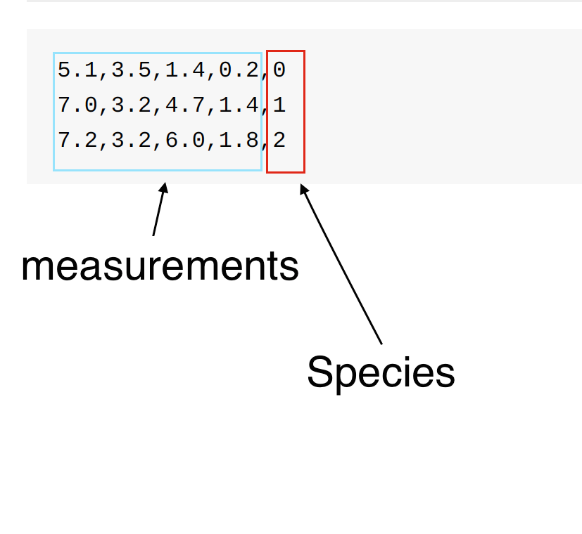

# Using DataVec to ingest a CSV dataset 

In this lab you will import data from a CSV file into a format suitable for a Neural Network. 

## Goals of this lab

* DataVec Introduction


# Step 1

* Open up IntelliJ
Open up IntelliJ and navigate to the Labs folder

# Step 2

* Open the DataVecLab class

Click on DataVecLab.java to open up the java class in the editor

# Step 3

* Review the Java Code

In this case the Neural Network has already been built. The goal of this Lab is to work through the Data ETL process using DataVec. 

* Understand the Challenge

The Iris.txt file has 150 records of measurements of 3 Irises. Iris Setosa, Iris Virginica, Iris versicolor. Measurements are Petal Length, Petal Width,Sepal Length, Sepal Width. 

The data is stored with numeric representation of the species, 0=> Setosa, 1 => Versicolor,2=> Virginica



# STEP 3

Review the needed steps. 

1. Read the File
2. Parse the Lines
3. Specify Label fields vs measurements
4. Create a DataSet object to pass into our Neural Network. 

DataVec Classes that will be used. 

https://deeplearning4j.org/datavecdoc/org/datavec/api/records/reader/RecordReader.html
https://deeplearning4j.org/datavecdoc/org/datavec/api/records/reader/impl/csv/CSVRecordReader.html

DeepLearning4J class that will be used

https://deeplearning4j.org/doc/org/deeplearning4j/datasets/datavec/RecordReaderDataSetIterator.html

Full DataVec JavaDoc
https://deeplearning4j.org/datavecdoc/

Full DeepLEarning4J JavaDoc.
https://deeplearning4j.org/doc/


Advanced users are welcome at this point to open up the stub and go for it. 

Everyone else please follow along with the instructions


### STEP 3 Set some parameters

CSVRecordReader is designed to be able to ignore the first x number of lines in a file. The assumption is the file may have header information or comments. 

Take a look at Iris.txt and confirm that it has no headers. 

CSVRecordReader is configurable in terms of how the data records are delimited. Verify that the file is comma delimeted. 

** Note bad data is a frequent problem, in this clean sterilized lab environment you can trust the data, in real world I always run some verication scripts to verify every line has the same amount of commas, at the very least. 


After verifying that there are no header lines, and the delimiter is a comma, add the following code to the stub program. 

```        
int numLinesToSkip = 0;
String delimiter = ",";
```    


## Create a RecordReader 

Add this line to the code stub

```
RecordReader recordReader = new CSVRecordReader(numLinesToSkip,delimiter);
```

## Initialize the RecordReader and pass it a file. 


For portability the file is put in the resources folder. This makes it available as a ClassPathResource. If you chose to get the path to the file and use that instead that is fine. 

This code snippet allows easy access to a file on the classpath
```new ClassPathResource(fileName).getFile()``` 


Initialize your record Reader and passed it a FileSplit. 

A FileSplit can point to a directory and the Record Reader can read all the files in the directory, or in this case it will point to a single file. 

```
recordReader.initialize(new FileSplit(new ClassPathResource("iris.txt").getFile()));
```


## Optional Step

Verify the Record Reader. 

You may want to verify the the Record Reader code is functional. 

The Record Reader returns an Iterator over a set of Records. 

Each call to next method returns an java.util.ArrayList of values. 


Some code to explore that would be. 

```
while( recordReader.hasNext()) {
            log.info(recordReader.next().toString());
            log.info(recordReader.next().getClass().toString());
        }
        recordReader.reset();

```

You would then run the code and see the records in the console window.


## Set some parameters for the DataSetIterator that you will create in the next step

```
int labelIndex = 4;     
//5 values in each row of the iris.txt CSV: 
//4 input features followed by an integer label (class) index. 
// Labels are the 5th value (index 4) in each row
        

int numClasses = 3;     
//3 classes (types of iris flowers) in the iris data set. 
//Classes have integer values 0, 1 or 2
        
int batchSize = 150;    
//Iris data set: 150 examples total. 
//We are loading all of them into one DataSet 
//(not recommended for large data sets)

```


##  Create a DataSet Iterator


A Record Reader returns an iterator over a List of Writables. Writables are an efficient serialization method inspired by Hadoop Writables. 

A Neural Net requires input as an Array of Numeric values. To do that use DataSetIterator. 

A DataSet will contain an INDArray of features, and an INDArray of Labels. 

Add the following code to the DataVecLab class. 

```
DataSetIterator iterator = new RecordReaderDataSetIterator(recordReader,batchSize,labelIndex,numClasses);
DataSet allData = iterator.next();
```

## Shuffle the Data

Typically a Neural network trains over the results of a minibatch. Suppose a minibatch of Ten. Ten records are passed through the error between expected value and observed output is calculated and the weights of the network are updated to reduce the error. Now look are our iris data set. All one species, followed by another species. If the records in a mini-batch are skewed towards one class then the network will train first in one direction then another. This is not good, shuffle your data. 

Add this code to the class. 

```
allData.shuffle();
```


## Split Train and Test

For supervised learning a network is trained on a collection of records and then tested on records it has not seen before. Split the data into test and train. 

Add the following code to the DataVecLab class. 


```
    SplitTestAndTrain testAndTrain = allData.splitTestAndTrain(0.65);  //Use 65% of data for training
    DataSet trainingData = testAndTrain.getTrain();
    DataSet testData = testAndTrain.getTest();
```

## Extra Credit

Normalize the DataSet

You should always Normalize/standardize your data. DeepLearning4J has tools to do that. 

http://nd4j.org/doc/org/nd4j/linalg/dataset/api/preprocessor/DataNormalization.html


## Extra Credit


Your data may be organized in many different ways. See the resources/irisData directory for some examples.


### Parent Path Label Generator:

Labels can be extracted based on the name of the parent directory using ParentPathLabelGenerator. The irisData directory has 3 folders one for iris virginica, one for iris setosa and one for iris versicolor. 

Write a datavec pipeline that extracts the label from the parent directory. 

### DataVec Spark Transform

Your data may have string labels instead of numeric values. DataVec has tools to build a Schema as read from the file, and then a target schema that transforms columns. In this case you would want to transform categorical to integer. 

An example of Spark Transform is available in demos/AbaloneDataTransform

In that demo the data has String Labels for Gender, M(male),F(Female),I(Infant)

A similar format for Iris Data is in the resources folder, 
```/resources/IrisData/iris_with_names.csv```


# <font color="red">END OF IRIS DATAVEC LAB</font>
