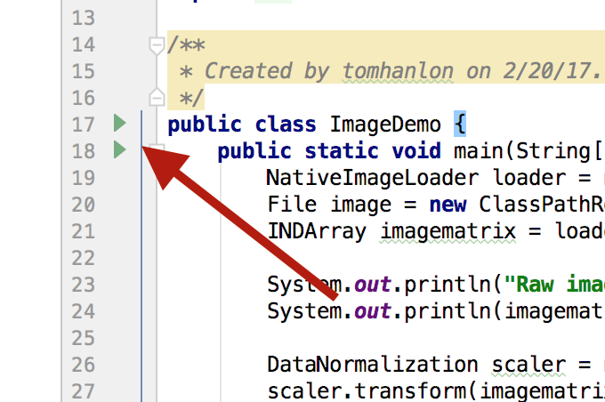
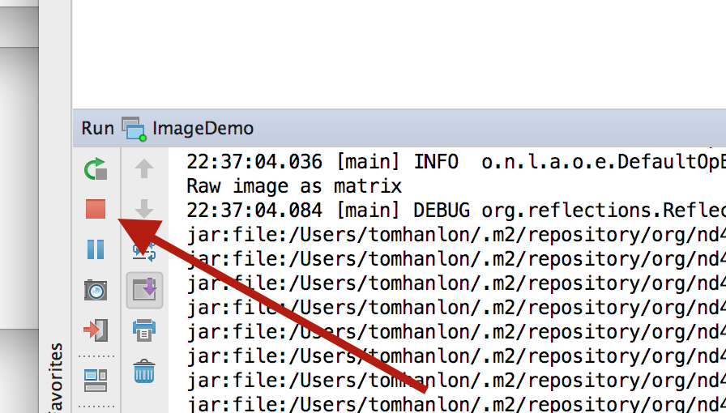

# Introduction

The Labs for this course are completed using Intellij. Your instructor will have provided either instructions for setting up Intellij or you will have a Virtual Machine with Intellij pre-installed and configured. 

1. Maven

We recommend you familiarize yourself with at least the basics of Maven for managing your DeepLearning4J projects. 

Maven uses a pom.xml file to manage dependencies. 

If exploring the pom.xml file for the lab project note that there are two levels, training-parent/pom.xml and training-parent/training-labs/pom.xml

2. Running and stopping code

When editing or creating a java class you can run it at any time by hitting the green arrow next to your main class.

* Run your code

---------------

* Stop your code

To stop the code you can hit the red button. 

---------
3. Common issues

A code problem anywhere is a problem everywhere. If the project fails to compile then you will not be able to run other classes that do compile. Running a class causes the whole project to compile, and if another broken class fails to compile, your working class will fail to run.

Solution, if you have an unfinished class or something that won't compile, you need to either fix it, or comment out the offending section

4. Work at your own pace. 

* Too Hard

There is a solution directory, use it as a last resort. If the Lab is too challenging remember you can work as far as you can, save the class in a working state or comment it out to the point where it at least compiles and move on. 

	
* Too Easy

You are welcome to start a blank project and work from scratch. If your questions are related to the course materials or the topic the instructor will happily answer your questions

<!-- I think this file needs to be present -->
