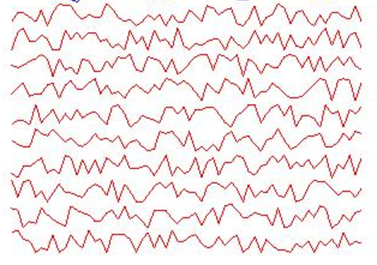
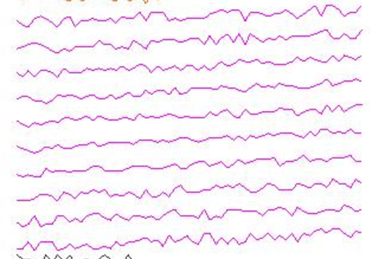
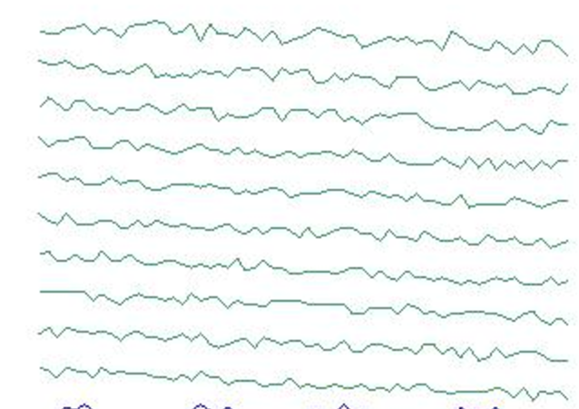
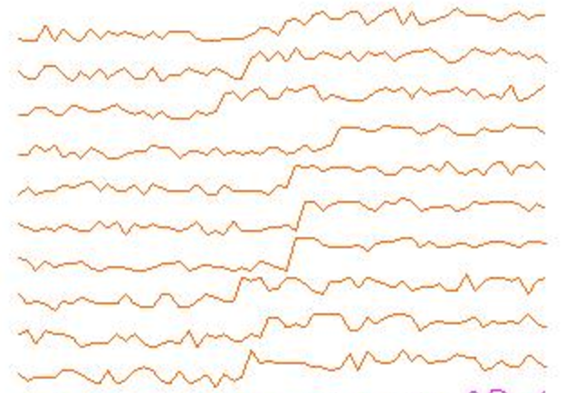
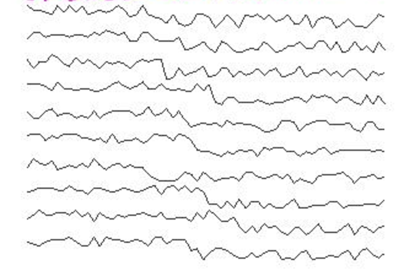

# Sequence Classification Lab

This Lab uses an LSTM Recurrent Neural Network to classify Sequence Data into 6 different classes. 

# The classes are: 

## Normal




-----------------
<div style="page-break-after: always;"></div>


## Cyclic


-----------------
<div style="page-break-after: always;"></div>

## Increasing trend




-----------------
<div style="page-break-after: always;"></div>

## Decreasing trend




-----------------
<div style="page-break-after: always;"></div>

## Upward shift




-----------------
<div style="page-break-after: always;"></div>

## Downward shift




-----------------
<div style="page-break-after: always;"></div>

# Lab Overview

* UCIdata.java
  * Utility class to download dataset
  * DO NOT EDIT UCIdata.java
* UCISequenceClassificationExample 
  * The class you will edit for this lab

-------------------
<div style="page-break-after: always;"></div>

# Lab Step 1 

Navigate to the UCISequenceClassificationExample and add a line to call the UCIData class that downloads the data. ***Note*** the download takes time, once downloaded another call to UCIData verifies the download has occured and does NOT download again. It is safe to run the download twice.

Add this line to the class. 

```
UCIData.download();
```

# Lab Step 2 

Set up the Record Readers for the Test and Train Data. 


Add this line to the class. 

```
SequenceRecordReader trainFeatures = new CSVSequenceRecordReader();
        trainFeatures.initialize(new NumberedFileInputSplit(ai.skymind.training.solutions.UCIData.featuresDirTrain.getAbsolutePath() + "/%d.csv", 0, 449));
        SequenceRecordReader trainLabels = new CSVSequenceRecordReader();
        trainLabels.initialize(new NumberedFileInputSplit(ai.skymind.training.solutions.UCIData.labelsDirTrain.getAbsolutePath() + "/%d.csv", 0, 449));
```

# Lab Step 3 

Set the miniBatchSize and the number of classes. 

Add these lines to the class. 

```
int miniBatchSize = 10;
int numLabelClasses = 6;
```


# Lab Step 4

Create a DataSetIterator for the training Data. 

The JavaDoc for the needed class is here, https://deeplearning4j.org/datavecdoc/org/datavec/api/records/reader/impl/csv/CSVSequenceRecordReader.html


Add this line to the class. 


```
DataSetIterator trainData = new SequenceRecordReaderDataSetIterator(trainFeatures, trainLabels, miniBatchSize, numLabelClasses,false, SequenceRecordReaderDataSetIterator.AlignmentMode.ALIGN_END);

```

# Lab Step 5

Normalize the data.

Add the following lines to the class.


```
DataNormalization normalizer = new NormalizerStandardize();
normalizer.fit(trainData);
trainData.setPreProcessor(normalizer);
```


# Lab Step 6

Set up the Test Data. 

Add the following lines to the class. 

```
 SequenceRecordReader testFeatures = new CSVSequenceRecordReader();
 testFeatures.initialize(new NumberedFileInputSplit(ai.skymind.training.solutions.UCIData.featuresDirTest.getAbsolutePath() + "/%d.csv", 0, 149));
 SequenceRecordReader testLabels = new CSVSequenceRecordReader();
 testLabels.initialize(new NumberedFileInputSplit(UCIData.labelsDirTest.getAbsolutePath() + "/%d.csv", 0, 149));
 DataSetIterator testData = new SequenceRecordReaderDataSetIterator(testFeatures, testLabels, miniBatchSize, numLabelClasses,false, SequenceRecordReaderDataSetIterator.AlignmentMode.ALIGN_END);
 testData.setPreProcessor(normalizer);
```


# Lab Step 7

Set up the Neural Network

Add the following lines of code to the class. 

```
MultiLayerConfiguration conf = new NeuralNetConfiguration.Builder()
    .seed(123)
    .optimizationAlgo(OptimizationAlgorithm.STOCHASTIC_GRADIENT_DESCENT).iterations(1)
    .weightInit(WeightInit.XAVIER)
    .updater(Updater.NESTEROVS).momentum(0.9)
    .learningRate(0.005)
    .gradientNormalization(GradientNormalization.ClipElementWiseAbsoluteValue)
    .gradientNormalizationThreshold(0.5)
    .list()
        .layer(0, new GravesLSTM.Builder().activation("tanh").nIn(1).nOut(10).build())
        .layer(1, new RnnOutputLayer.Builder(LossFunctions.LossFunction.MCXENT)
            .activation("softmax").nIn(10).nOut(numLabelClasses).build())
            .pretrain(false).backprop(true).build();

        MultiLayerNetwork net = new MultiLayerNetwork(conf);
        net.init();
```

# Lab Step 8

Add a UI

Add the following lines to the class. 


```
UIServer uiServer = UIServer.getInstance();
StatsStorage statsStorage = new InMemoryStatsStorage();
net.setListeners(new StatsListener(statsStorage));
uiServer.attach(statsStorage);
```

# Lab Step 9

Train the network. 

Add the following lines to the class. 

```
int nEpochs = 40;
    String str = "Test set evaluation at epoch %d: Accuracy = %.2f, F1 = %.2f";
    for (int i = 0; i < nEpochs; i++) {
		net.fit(trainData);
        Evaluation evaluation = net.evaluate(testData);
        log.info(String.format(str, i, evaluation.accuracy(), evaluation.f1()));
        testData.reset();
        trainData.reset();
}
        log.info("----- Example Complete -----");
```			


-

--------
<div style="page-break-after: always;"></div>


<!-- 


---------
<div style="page-break-after: always;"></div>

-->
