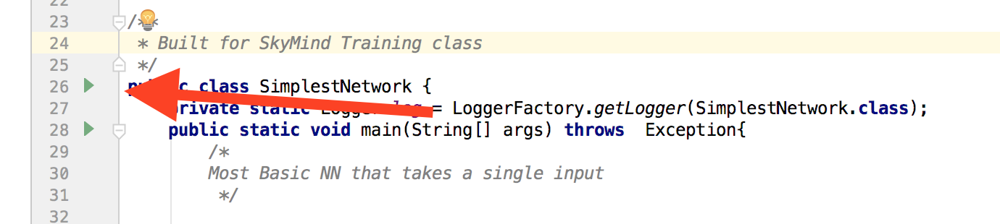
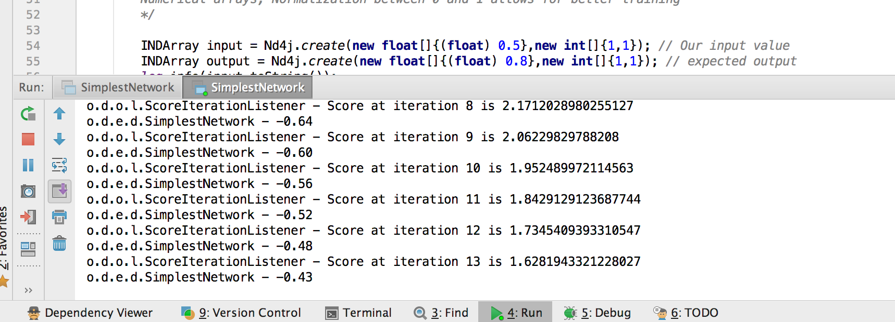
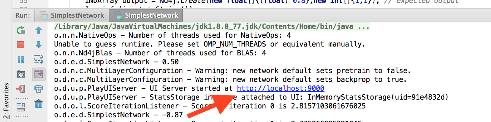
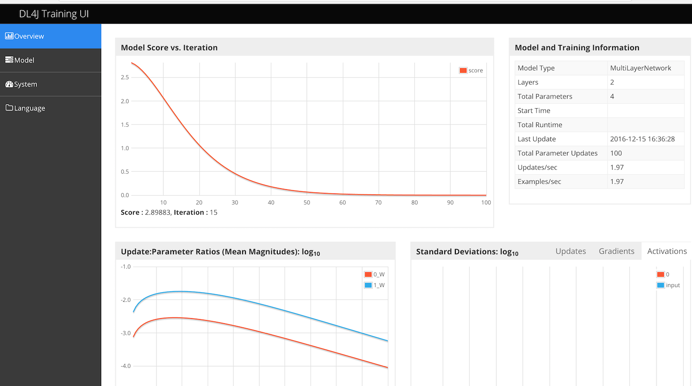
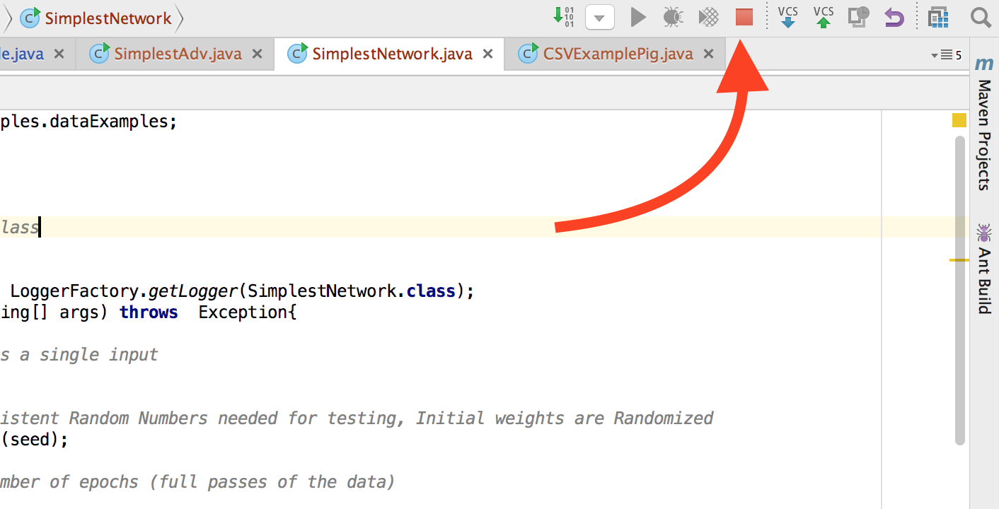
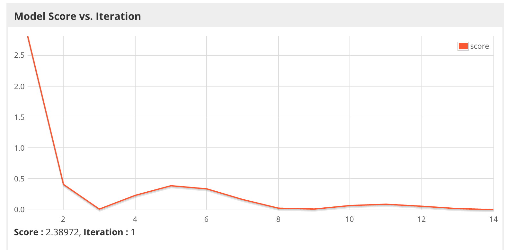

# Simplest Neural Network 

In this Lab you will explore a very simple Neural Network. The Neural Network will consist of

* One input
* One expected numeric output
* One Hidden Layer with a single neuron

The Neural Net will receive the input of 0.5, the expected output will be 0.8 . 

The Neural Net will train for 100 epochs with the goal of improving it's score, how close it gets to 0.8 .

## Goals of this lab

* To familiarize the user with DeepLEarning4J code.
	* MultiLayer Network
		* fit
		
	* Parameters
		* Number of Epochs
		* Training Rate
		* Optimization Algorithm
		* Updater
	* UI server
	

# Step 1

* Open up IntelliJ
Open up IntelliJ and navigate to the Labs folder

# Step 2

* Open the SimplestNetwork class

Click on SimplestNetwork.java to open up the java class in the editor

# Step 3

* Review the Java Code

Note the parameters set at the top. 


```
int seed = 123;
```

This is a hardcoded random seed to allow repeatable results. The Neural Net begins by assigning random weights to the matrix(?). If we want repeatable results then using a pre configured seed allows that.  

If you change the seed, your networks behavior will change slightly as well. 

```
int numInputs = 1;
int numOutputs = 1;
```

### Xavier, why Xavier

In short, it helps signals reach deep into the network.

If the weights in a network start too small, then the signal shrinks as it passes through each layer until it’s too tiny to be useful.
If the weights in a network start too large, then the signal grows as it passes through each layer until it’s too massive to be useful.
Xavier initialization makes sure the weights are ‘just right’, keeping the signal in a reasonable range of values through many layers.

To go any further than this, you’re going to need a small amount of statistics - specifically you need to know about random distributions and their variance.


### STOCHASTIC GRADIENT DESCENT

Note that the Optimiaztion Algoithm is Stochastic Gradient Descent. 

As Neural Netowrks have been researched over the years the challenge of updating large matrices with modified weights to lead to less error(better answers) has been significant. The numerical computation in particular. SGD meets this challenge by making random choices in some way, research this further. 

## Updater Nesterovs

Without going into the updater in detail Note that momentum may be a hyperparameter that will need tuning on more complex networks. The problem in this demo is linear (? is it) but in a more complex graph with potential local minima momentum helps break through that. How deep do I go here? 

### Layer 0 activation tanh

The activation function of a Layer determines the signal it sends to connected neurons. 

Choices are sigmoid, smooth curve output 0-1 as x increases. 

tanh similar to sigmoid output -1-> +1 depending on value of x

Stepwise output 0 or 1 depending on value of X

Etc going to deep here. 

### Layer1 this is our output layer. 

Note the activation is identity. 

This determines that the output will be linear, a range of numeric values, 
.1, .2, .3 etc. VS 0 or 1, vs Class A, B or C


# STEP 3

Run the code

In this step you will run the code. 

When the code executes it will create a UI that can be accessed with a web browser. 

It will also print output to the output window at the bottom of intellij as it runs

## Click on this green arrow to execute the code



## View the output in the console while the class runs




## View the UI

When the code executes and the UI is created, a line is generated in the console output with the url



Open that URL in a browser

You should see this



## Explanation of the output

Console Output. 

The following block of code is what begins the training process. 

```
 for( int i=0; i<nEpochs; i++ ){
            model.fit(input,output);
            INDArray output2 = model.output(input);
            log.info(output2.toString());
            Thread.sleep(500);
        }
```	

## What is an Epoch?

It is a loop for the total number of Epochs. Or total passes through the training dataset, in this case our single input, but in real use cases it might be something like thousands of text reviews, or hundreds of thousands of images, or milllions od lines from log files. 

## What is Model.fit?

This is where the model trains. Data is ingested, random weights are assigned, output is evaluated against expected and weights are adjusted to lessen the error. 

## What output should look like

This section 

```
INDArray output2 = model.output(input);
            log.info(output2.toString());
```

Generates these lines in our console output. 

```
o.d.e.d.SimplestNetwork - -0.87
o.d.e.d.SimplestNetwork - -0.85
```

The "correct" output, or "expected" output is 0.80, you will see that the network is consistently getting closer to that goal as it trains. 

This line in the console output
```
o.d.o.l.ScoreIterationListener - Score at iteration 1 is 2.775866985321045
```

Is generated by this line

```
model.setListeners(new StatsListener(statsStorage),new ScoreIterationListener(1));
```


# STEP 4

In this step you will modify some of the parameters and see the effect on the training process. 

Note that anytime you re-run this code you will have to terminate the previous running process. The webserver serving the UI will have a handle on a socket and the second example will try to grab that same socket, fail and return an error. 

Kill the running process by clickin on the red square, top right. 




Some parameters that you could tune. 

Before you change things, note the current performance. 
How many iterations till it got to within .05 of the target?
In 100 iterations how close did it get? 
Mine got to .78 after 100, and reached .75 at iteration 80

## Settings you may change with reasonable results

### Hidden Nodes

* Number of hidden nodes
	* Would provide more attempts towards the correct answer, more random weights, and may train quicker

### Number of Epochs

* Number of Epochs
	* If the network is converging on the target, then more epochs should allow it to get there, in time
	* Note that to prevent things going to fast to visualize,I put a sleep .5 seconds in the loop. 
	* Remove that if you set to large number of Epochs. 

	

### Learning Rate

Learning Rate Determines how far to adjust the weights given the error. 

A range for learning rates would be ???

```
double learningRate = 0.001;
```

Change to perhaps...

```
double learningRate = 0.01;
```

Note that an aggressive learning rate may cause the network to overshoot the target before converging.





# Lab questions

1. What parameters may need adjusting in a Neural Net


# <font color="red">END OF SIMPLEST NETWORK LAB</font>


