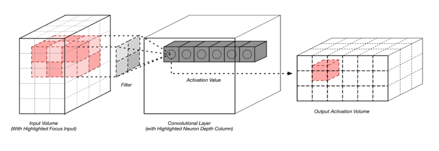

!SLIDE center subsection

# Convolutional Neural Networks

~~~SECTION:notes~~~
# Move up to before LSTM
# CNN are better than human
# Mention GANS
# SEE Mathew zyler, rob fergus NYU visualization paper 2013
# Add wrapup chapter
~~~ENDSECTION~~~

!SLIDE

# Convolutional Neural Networks

* Convolutional Neural Networks are best-inclass
today for image classification
* Uses locally connected filters to “scan” for
features In image data
	* Better able to deal with scale and rotation of image
features
* Typically is a repeating pattern of:
  * Convolution Layer
  * ReLU Layer
  * Pooling Layer

!SLIDE

# Convolutional Neural Network

# Note mention recent move to less Pool Layers

!SLIDE

# Convolutional Image Explained

* Convolution layers “filter” x to extract features
  * Filters exploit (spatially) local regularities while preserving spatial relationships
* Subsampling (pooling) layers combine local information, reduce resolution
  * pooling gives translational invariance (i.e., classifier robust to shifts in x)
* Predict y from x with local structure (e.g., images, short time series)
  * 2D: classify images of, e.g., cats, cat may appear in different locations
  * 1D: diagnose patients from lab time series, symptoms at different times
* Special case: fully convolutional network with no MLP at “top” (filter for variablesized
x’s)

!SLIDE

# Convolutional Neural Network

!SLIDE

# 3 Dimensional Input

!SLIDE

# Convolutions

!SLIDE

# Mnist Digits

!SLIDE

# Learning Filters

!SLIDE

# Building 3D Output

!SLIDE
!SLIDE

