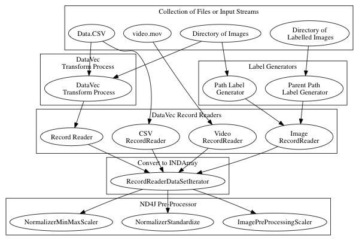
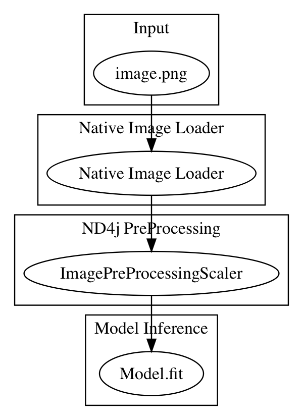

# DeepLearning4J Overview

<div style="page-break-after: always;"></div>

---------------------

# DeepLearning4J Overview

* Goals of the DeepLearning4J project
* Parts of the DeepLearning4J project
  * DataVec
  * ND4J
  * DeepLearning4J

<div style="page-break-after: always;"></div>

----------------------

* **Goals of the DeepLearning4J project**
To provide a java based toolkit for building, training and deploying Neural Networks.
* DeepLearning4J sub-projects
  * DataVec
  * ND4J
  * DeepLearning4J


-------------------
<div style="page-break-after: always;"></div>

---------------

# Goals of the DeepLearning4J project

* Provide a Toolkit for using DeepLearning on the JVM
	* Enterprise users
	* Security
	* Flexibility


-------------------
<div style="page-break-after: always;"></div>

# Why Java?


-------------------
<div style="page-break-after: always;"></div>

----------------------

* Goals of the DeepLearning4J project
* **Parts of the DeepLearning4J project**
  * DataVec
  * ND4J
  * DeepLearning4J


-------------------

<div style="page-break-after: always;"></div>

---------------


# DeepLearning4J projects

* DataVec
	* Tools for ETL
* ND4J
	* Numeric Arrays, 
	* like Numpy is for Python ND4J is for Java
* libND4J
	* Native Libraries for efficent compute on GPU's/CPU's
* DeepLearning4J
	* Tools to build and train Neural Nets

-------------------
<div style="page-break-after: always;"></div>

# DataVec 

* Neural Nets ingest numeric arrays
* Datavec helps you get from your_data => Numeric Array

-------------------
<div style="page-break-after: always;"></div>

# Data Sources

* log files 
* text documents 
* tabular data
* images and video
* and more !!

-------------------
<div style="page-break-after: always;"></div>

# Goal

* Convert each data type into a collection of numerical values in a MultiDimensional Array


-------------------
<div style="page-break-after: always;"></div>

# More Features

* Transformation 
* Scaling 
* Shuffling 
* Joining 
* Splitting

-------------------
<div style="page-break-after: always;"></div>

# Commonly Used Features

* RecordReaders
  * Read files or input, convert to List of Writables
* Normalizers
  * Standardize, scale or Nomralize the data
* Transform Process
  * Join datasets, replace strings with numerics, extract labels  

-------------------
<div style="page-break-after: always;"></div>

# Diagram of available ETL paths



-------------------
<div style="page-break-after: always;"></div>


# Image Basics

* Images are arrays of pixel values.


-------------------
<div style="page-break-after: always;"></div>

# White box black square image as INDArray

```
        INDArray imagematrix = loader.asMatrix(image);
		System.out.println(imagematrix);
```

# Output

```
[[[[255.00, 255.00, 255.00, 255.00],
   [255.00, 0.00, 0.00, 255.00],
   [255.00, 0.00, 0.00, 255.00],
   [255.00, 255.00, 255.00, 255.00]]]]
```   

-------------------
<div style="page-break-after: always;"></div>

# Scale values between 0 and 1

```
    DataNormalization scaler = new ImagePreProcessingScaler(0,1);
    scaler.transform(imagematrix);
```

# Output

```
[[[[1.00, 1.00, 1.00, 1.00],
   [1.00, 0.00, 0.00, 1.00],
   [1.00, 0.00, 0.00, 1.00],
   [1.00, 1.00, 1.00, 1.00]]]]
```   

-------------------
<div style="page-break-after: always;"></div>

# Manipulating images with DataVec 

* Scale images to same dimensions with RecordReader

```
ImageRecordReader recordReader = new ImageRecordReader(height,width,channels);
```

* Scale image to appropriate dimenstions with NativeImageLoader

```
NativeImageLoader loader = new NativeImageLoader(height, width, channels); \\ load and scale
INDArray image = loader.asMatrix(file); \\ create INDarray
INDArray output = model.output(image);   \\ get model prediction for image
```

-------------------
<div style="page-break-after: always;"></div>

# Image Data Set Augmentation

* Create "larger" training set with OpenCV tools
	* Transform
	* Crop
	* Skew

-------------------
<div style="page-break-after: always;"></div>

# Applying Labels

* ParentPathLabelGenerator
* PathLabelGenerator

-------------------
<div style="page-break-after: always;"></div>

# Image Transform

* Grab the table from this page
https://deeplearning4j.org/etl-userguide
* Scale Pixel Values

```
DataNormalization scaler = new ImagePreProcessingScaler(0,1);
scaler.fit(dataIter);
dataIter.setPreProcessor(scaler);
```	

-------------------
<div style="page-break-after: always;"></div>

# Available ND4J Pre-Processors

* ImagePreProcessingScaler
  * min max scaling default 0 + - 1
* NormalizerMinMaxScaler
  * ?
* NormalizerStandardize
  * moving column wise variance and mean
  * no need to pre-process ? 
  
-------------------
<div style="page-break-after: always;"></div>

# Image Transforms with JavaCV, OpenCV, ffmpeg

-------------------
<div style="page-break-after: always;"></div>

# Image pipeline to pre-trained model

ETL_single_image.png



-------------------
<div style="page-break-after: always;"></div>


# DataVec Example

* CSV => NDArray
```
public class CSVExample {

    private static Logger log = LoggerFactory.getLogger(CSVExample.class);

    public static void main(String[] args) throws  Exception {

        //First: get the dataset using the record reader. CSVRecordReader handles loading/parsing
        int numLinesToSkip = 0;
        String delimiter = ",";
        RecordReader recordReader = new CSVRecordReader(numLinesToSkip,delimiter);
        recordReader.initialize(new FileSplit(new ClassPathResource("iris.txt").getFile()));

        //Second: the RecordReaderDataSetIterator handles conversion to DataSet objects, ready for use in neural network
        int labelIndex = 4;     //5 values in each row of the iris.txt CSV: 4 input features followed by an integer label (class) index. Labels are the 5th value (index 4) in each row
        int numClasses = 3;     //3 classes (types of iris flowers) in the iris data set. Classes have integer values 0, 1 or 2
        int batchSize = 150;    //Iris data set: 150 examples total. We are loading all of them into one DataSet (not recommended for large data sets)

        DataSetIterator iterator = new RecordReaderDataSetIterator(recordReader,batchSize,labelIndex,numClasses);
        DataSet allData = iterator.next();
```		
-------------------
<div style="page-break-after: always;"></div>

# DataVec Code Explained

* RecordReader recordReader = new CSVRecordReader(numLinesToSkip,delimiter);
	* A RecordReader prepares a list of Writables
	* A Writable is an efficient Serialization format
* DataSetIterator iterator = new RecordReaderDataSetIterator
	* We are in DL4J know, with DataSetIterator
	* Builds an Iterator over the list of records
* DataSet allData = iterator.next();
	* Builds a DataSet


-------------------
<div style="page-break-after: always;"></div>

# Frequently Used DataVec classes

* CSVRecordReader
	* CSV Text Data
* ImageRecordReader	
	* Convert Image to numeric array representing pixel values
*  JacksonRecordReader
	* Parses JSON records
* ParentPathLabelGenerator
	* Builds labels based on Directory Path 
* Transform, Transform Process Builder, TransformProcess
	* Conversion tools


-------------------
<div style="page-break-after: always;"></div>

# ND4J

* Provides Scientific Computing Libraries
* Main features
	* Versatile n-dimensional array object
	* Multiplatform functionality including GPUs
	* Linear algebra and signal processing functions


-------------------
<div style="page-break-after: always;"></div>

# ND4J and DeepLearning

* Neural Nets work with Numerical Arrays
* Classes frequently Used
	* DataSet
	* DataSetIterator

-------------------
<div style="page-break-after: always;"></div>


# libND4J

* The C++ engine that powers ND4J
	* Speed
	* CPU and GPU support


-------------------
<div style="page-break-after: always;"></div>

# DeepLearning4J

* Tools to build and train Neural Networks
* MultiLayerNetworkConfig
	* Build a Neural Network Configuration
* MultiLayerNetwork
	* Intiitalize a Network from a Configuration
* ComputationGraphConfiguration
	* A more flexible Network that MultiLayer
* ComputationGraph
	* Initialize a Computation Graph

-------------------
<div style="page-break-after: always;"></div>

# DeepLearning4J Frequently used Classes

* MultiLayerNetwork.fit
	* Trains a Model
* Evaluation
	* Evaluates model output against known labelled data
* ModelSerializer
	* Saves and loads trained models
* model.output
	* gets model's output for a single input


-------------------
<div style="page-break-after: always;"></div>

# DeepLearning4J sample code

```
MultiLayerConfiguration conf = new NeuralNetConfiguration.Builder()
                .seed(seed)
                .iterations(1)
                .optimizationAlgo(OptimizationAlgorithm.STOCHASTIC_GRADIENT_DESCENT)
                .learningRate(learningRate)
                .updater(Updater.NESTEROVS).momentum(0.9)
                .list()
                .layer(0, new DenseLayer.Builder().nIn(numInputs).nOut(numHiddenNodes)
                        .weightInit(WeightInit.XAVIER)
                        .activation("relu")
                        .build())
                .layer(1, new OutputLayer.Builder(LossFunction.NEGATIVELOGLIKELIHOOD)
                        .weightInit(WeightInit.XAVIER)
                        .activation("softmax").weightInit(WeightInit.XAVIER)
                        .nIn(numHiddenNodes).nOut(numOutputs).build())
                .pretrain(false).backprop(true).build();


        MultiLayerNetwork model = new MultiLayerNetwork(conf);
        model.init();
        model.setListeners(new ScoreIterationListener(10));  //Print score every 10 parameter updates


        for ( int n = 0; n < nEpochs; n++) {
            model.fit( trainIter );
        }

        System.out.println("Evaluate model....");
        Evaluation eval = new Evaluation(numOutputs);
        while(testIter.hasNext()){
            DataSet t = testIter.next();
            INDArray features = t.getFeatureMatrix();
            INDArray lables = t.getLabels();
            INDArray predicted = model.output(features,false);

            eval.eval(lables, predicted);

        }
```		

-------------------
<div style="page-break-after: always;"></div>


# Class Details

We could spend a whole day on DataVec, a whole day on ND4J and then a whole day on DL4j. Instead we will focus on particular network problems and teach the needed rewuirements for each, then repeat. Covering the key concepts along the way. 

-------------------
<div style="page-break-after: always;"></div>

# Chapter Questions

* DataVec Question
* ND4J question
* DL4J question
