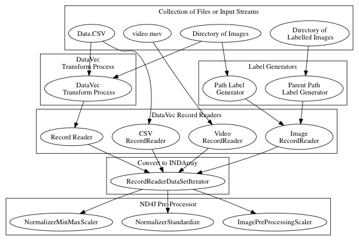
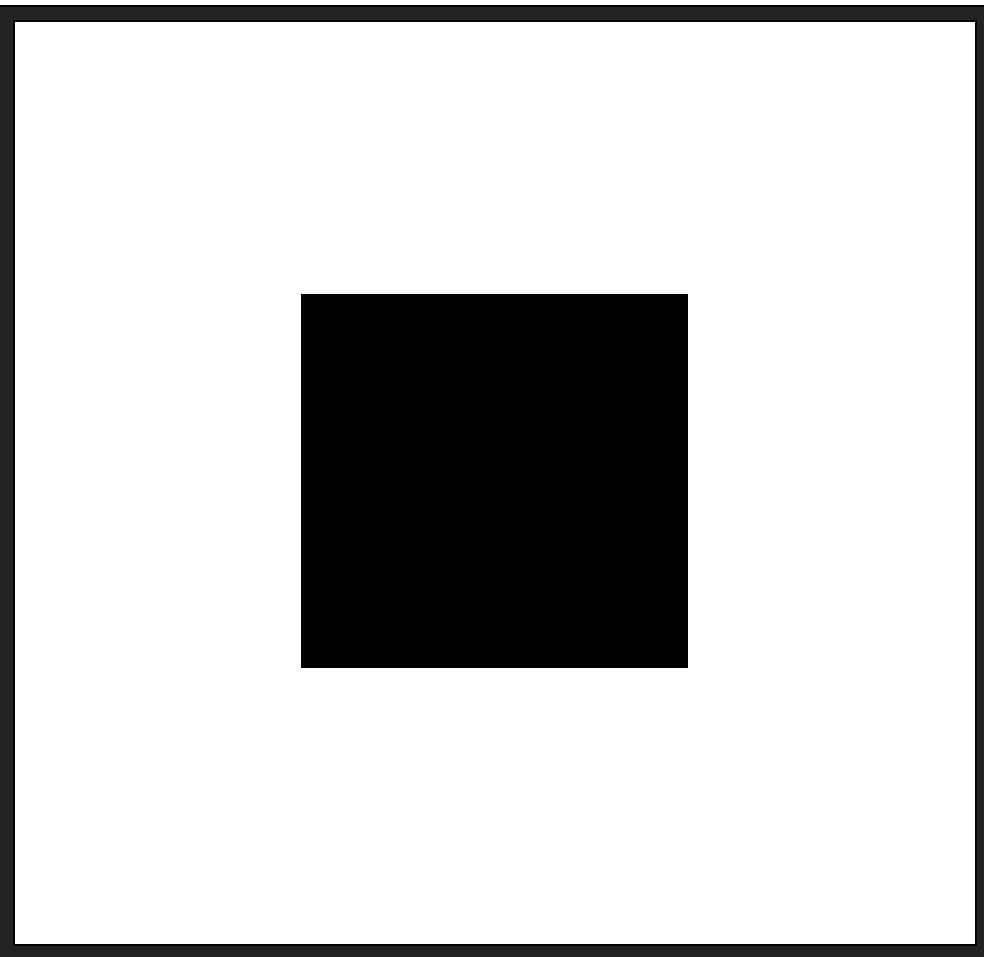

!SLIDE center subsection

# DataVec

* Neural networks process numeric arrays
* Datavec helps you get from your_data => numeric array

!SLIDE

# Data Sources

* Log files
* Text documents
* Tabular data
* Images and video
* and more !!

!SLIDE

# Goal

* Build a user freindly comprehensive toolkit for data pilelines into Neural Netowrks


!SLIDE

# DataVec Features

* Transformation
* Scaling
* Shuffling
* Joining
* Splitting Test and Train

!SLIDE

# Commonly Used Features

* RecordReaders
  * Read files or input, convert to List of Writables
* Normalizers
  * Standardize, scale or normalize the data
* Transform Process
  * Join datasets, replace strings with numerics, extract labels

!SLIDE

# Diagram of available ETL paths



!SLIDE


# DataVec Image Basics

* Images are arrays of pixel values




!SLIDE

# Code Example: Load above image as INDArray

```
        INDArray imagematrix = loader.asMatrix(image);
		System.out.println(imagematrix);
```

# Output

```
[[[[255.00, 255.00, 255.00, 255.00],
   [255.00, 0.00, 0.00, 255.00],
   [255.00, 0.00, 0.00, 255.00],
   [255.00, 255.00, 255.00, 255.00]]]]
```

!SLIDE

# Code Example: Scale values between 0 and 1

```
    DataNormalization scaler = new ImagePreProcessingScaler(0,1);
    scaler.transform(imagematrix);
```

# Output

```
[[[[1.00, 1.00, 1.00, 1.00],
   [1.00, 0.00, 0.00, 1.00],
   [1.00, 0.00, 0.00, 1.00],
   [1.00, 1.00, 1.00, 1.00]]]]
```

!SLIDE

# Manipulating Images with DataVec

* Scale images to same dimensions with RecordReader
* Used in pipeline for example in training

```
ImageRecordReader recordReader = new ImageRecordReader(height,width,channels);
```

* Scale image to appropriate dimenstions with NativeImageLoader
* Used one-off for example in inference

```
NativeImageLoader loader = new NativeImageLoader(height, width, channels); \\ load and scale
INDArray image = loader.asMatrix(file); \\ create INDarray
INDArray output = model.output(image);   \\ get model prediction for image
```

!SLIDE

# Code Example: Image Transform

* Scale pixel values

```
DataNormalization scaler = new ImagePreProcessingScaler(0,1);
scaler.fit(dataIter);
dataIter.setPreProcessor(scaler);
```


!SLIDE

# Image Data Set Augmentation

* Create "larger" training set with OpenCV/dataVec tools
	* Transform
	* Crop
	* Skew

!SLIDE

# Applying Labels

* ParentPathLabelGenerator
* PathLabelGenerator

!SLIDE

# Available Record Readers

* Table of available record readers:
  * https://deeplearning4j.org/etl-userguide


!SLIDE

# Available ND4J Pre-Processors

* ImagePreProcessingScaler
  * min max scaling default 0 + - 1
* NormalizerMinMaxScaler
  * Scale values observed min -> 0, observed max -> 1 
* NormalizerStandardize
  * moving column wise variance and mean
  * no need to pre-process

!SLIDE

# Image Transforms with JavaCV, OpenCV, ffmpeg

* Libraries included


!SLIDE

# Make this first intro to this for inference, and clean order

# Image pipeline Single Image to Pre-Trained Model


!SLIDE


# Code Example: CSV Data to INDArray

	
	public class CSVExample {
	private static Logger log = LoggerFactory.getLogger(CSVExample.class);
	public static void main(String[] args) throws  Exception {
        //First: get the dataset using the record reader. 
		//CSVRecordReader handles loading/parsing
        int numLinesToSkip = 0;
        String delimiter = ",";
        RecordReader recordReader = 
		new CSVRecordReader(numLinesToSkip,delimiter);
        recordReader.initialize(new FileSplit
		(new ClassPathResource("iris.txt").getFile()));


!SLIDE 

# Code Example: Continued....


	//Second: the RecordReaderDataSetIterator 
		//handles conversion to 
		//DataSet objects, ready for use in neural network
        int labelIndex = 4;     
		//5 values in each row of the iris.txt CSV: 
		//4 input features followed by an integer label (class) index. 
		//Labels are the 5th value (index 4) in each row
        int numClasses = 3;     
		//3 classes (types of iris flowers) in the iris data set. 
		//Classes have integer values 0, 1 or 2
        int batchSize = 150; 
		//Iris data set: 150 examples total. 
		//Loading all of them into one DataSet 
		//(not recommended for large data sets)

        DataSetIterator iterator = 
		new RecordReaderDataSetIterator
		(recordReader,batchSize,labelIndex,numClasses);
        DataSet allData = iterator.next();


!SLIDE

# DataVec Code Explained

* RecordReader recordReader = new CSVRecordReader(numLinesToSkip,delimiter);
	* A RecordReader prepares a list of Writables
	* A Writable is an efficient Serialization format
* DataSetIterator iterator = new RecordReaderDataSetIterator
	* We are in DL4J know, with DataSetIterator
	* Builds an Iterator over the list of records
* DataSet allData = iterator.next();
	* Builds a DataSet
	* INDArray of Features, INDArray of Labels


!SLIDE

# Frequently Used DataVec classes

* CSVRecordReader
	* CSV text data
* ImageRecordReader
	* Convert image to numeric array representing pixel values
*  JacksonRecordReader
	* Parses JSON records
* ParentPathLabelGenerator
	* Builds labels based on directory path
* Transform, Transform Process Builder, TransformProcess
	* Conversion tools


!SLIDE
