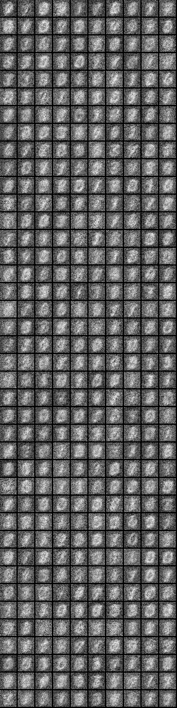

# DeepLearning INTRO

This might be too much repeat or need to be merged into other section

# Table of Contents

* Defining Deep Learning

----------------------
# Defining Deep Learning

* Higher neuron counts than in previous generation neural networks
* Different and evolved ways to connect layers inside neural networks
* More computing power to train
* Automated Feature Learning

-------------------

# Automated Feature Learning

* Deep Learning can be thought of as workflows for automated feature construction
	* From “feature construction” to “feature learning”
* As Yann LeCun says:
	* “machines that learn to represent the world”

-------------------

# MNist Image Learning Example

- would be nice to make this a demo - 

* The Following Slides Show a Network as it learns features

-------------------

-------------------

-------------------

-------------------

# Review of Previous Slides

* These are the features learned at each neuron in a Restricted Boltzmann Machine (RBMS)

* These features are passed to higher levels of RBMs to learn more complicated things.

TH- add more stuff on this

-------------------

# Factors influencing DeepLearning Craze

* GPU's enabling matrix-matrix computation
	* Can train extremely useful networks in weeks rather than years
* More data to traing
	* Can deliver enough data so that the network can learn needed patterns
	* Compare it to biological networks, how much data does an infant train on before first word? A LOT !!

-------------------

# Recent success of Deep Learning

* Image
* Speech
* other

This needs broken out and clarified, imagenet, speech, etc

-------------------

# Unreasonable Effectiveness: Benchmark Records

1. Text-to-speech synthesis (Fan et al., Microsoft, Interspeech 2014) 
2. Language identification (Gonzalez-Dominguez et al., Google, Interspeech 2014) 
3. Large vocabulary speech recognition (Sak et al., Google, Interspeech 2014) 
4. Prosody contour prediction (Fernandez et al., IBM, Interspeech 2014) 
5. Medium vocabulary speech recognition (Geiger et al., Interspeech 2014) 
6. English to French translation (Sutskever et al., Google, NIPS 2014) 
7. Audio onset detection (Marchi et al., ICASSP 2014) 
8. Social signal classification (Brueckner & Schulter, ICASSP 2014) 
9. Arabic handwriting recognition (Bluche et al., DAS 2014) 
10. TIMIT phoneme recognition (Graves et al., ICASSP 2013) 
11. Optical character recognition (Breuel et al., ICDAR 2013) 
12. Image caption generation (Vinyals et al., Google, 2014) 
13. Video to textual description (Donahue et al., 2014) 
14. Syntactic parsing for Natural Language Processing (Vinyals et al., Google, 2014) 
15. Photo-real talking heads (Soong and Wang, Microsoft, 2014).

-------------------

# Four Major Architectures

* Deep Belief Networks
* Convolutional Neural Networks
* Recurrent Neural Networks
* Recursive Neural Networks

-------------------

# The More Things Change…

-- need to move this from Josh, conversational style to more formal-

* Deep Learning is still trying to answer the same fundamental questions such as:
	* “is this image a face?”
* The difference is Deep Learning makes hard questions easier to answer with better architectures and more computing power
	* We do this by matching the correct architecture w the right problem

-------------------

# Choosing the Right Architecture

* Timeseries or Audio Input
	* Use a Recurrent Neural Network
	* Examples: Fraud Detection, Anomaly Detection
* Image input
	* Use a Convolutional Neural Network
* Video input
	* Use a hybrid Convolutional + Recurrent Architecture!

-------------------

# Common Architectural Principals

* Layer-oriented architecture
	* But have different types of hidden layers
			* Different schemes of connectivity
	* Connection weights are still parameters
* Activation functions control how information propagates from one layer to next
* Input / Output layer concepts still the same

-------------------

# Evolution of Layers

* Layers evolve to have different types of connections
* Classic Feed Forward Neural Network: Fully-Connected
* Convolutional Neural Network
	* Connected to spatially-local areas of previous layer
	* Connected to full depth of output
* Recurrent Neural Networks
	* Connections from previous timesteps

-------------------

# The fundamental pieces of a Neural Network

* Activation function, defined per layer for all neurons in that layer, the activation function determines what output signal based on input signal. 
* Loss Function, how error is calculated so that network can modify weights and train
* Optimization algorithm determine how given a specific error calculation the weights are modified

-------------------

# Hyper Parameters Summarized

* Layer Count
* Learning Rate
* Parameter Count
	* Neurons per layer
* Loss Function Type
* Optimization Algorithm

-------------------

# Activation Function

* An activation function determines what output signal is generated based on the input signals. 
* Borrowed concept from biological neurons where a neuron "fires" past a certain threshold.
* Some evolution has occured over time.

-------------------

# Activation Functions

* Sigmoid is considered a classical neural network activation function
	* Fallen out of favor more recently
* Model Deep Networks use
	* Rectified Linear Units (ReLU)
	* TanH

-------------------

# Activation Functions Illustrated

Add pictures of each, describe Vanishing Gradient Problem or not

-------------------

# Loss Functions

Need good definition here

* Regression
	* Squared Loss
* Classification
	* Hinge Loss
		* Binary classifier (“hard classification”)
* Logistic Loss
	* When we want probabilities as opposed to hard classifications

-------------------

# Optimization Algorithms

* Stochastic Gradient Descent
	* Most common
* L-BFGS
* Conjugate Gradient
* Hessian Free

-------------------

# Hyperparameters

* Layer Count
* Learning Rate
* Parameter Count
	* Neurons per layer
* Loss Function Type
* Optimization Algorithm

-------------------

# Building Blocks of Deep Networks

* Some networks are composed of other networks
	* Use sub networks to extract features
* Example Deep Belief Networks
	* Use a set of Restricted Belief Networks to extract good initial parameter values
* AutoEncoders
	* Can learn to find a minimal representation of the input data

-------------------

# Deep Belief Network

-------------------

# TO DO

--add pictures of Feed Forward, LSTM, etc.

-------------------

