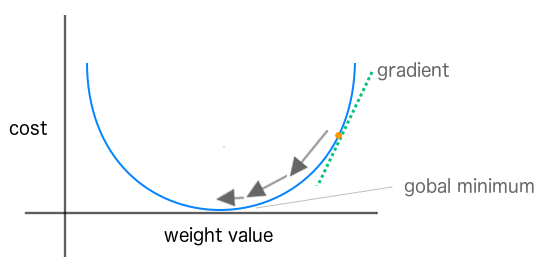

!SLIDE center subsection

# Framing the Question

!SLIDE

# Using Neural Networks

## Framing the Questions

* To build models we have to define
	* What is our training data (“evidence”)?
	* What kind of model (“hypothesis”) is appropriate for this data?
	* What kind of answer (“inference”) would we like to get from the model?
* These questions frame all machine learning workflows

!SLIDE

#  In neural networks we’re solving systems of (non-linear) equations of the form

## Ax = b

* A matrix
	* This is our set of input data converted into an array of vectors
* x vector
	* The parameter vector of weights representing our model
* b vector
	* Vector of output values or labels matching the rows  in the A matrix

!SLIDE

#Ax = b Visually

!SLIDE

#Linear Algebra Terms

* Scalars
	- Elements in a vector
	- In compsci synonymous with the term “variable”
* Vectors
	* For a positive integer n, a vector is an n-tuple, ordered (multi)set, or array of n numbers, called elements or scalars
* Matricies
	* Group of vectors that have the same dimension (number of columns)

!SLIDE

#Solving Systems of Equations
* Two general methods
	* Direct method
	* Iterative methods
* Direct method
	* Fixed set of computation gives answer
	* Data fits in memory
	* Ex: Gaussian Elimination, Normal Equations
* Iterative methods
	* Converges after a series of steps
    * Stochastic Gradient Descent (SGD)

!SLIDE

# Neural Networks Use an Iterative Method to Solve a System of Equations

~~~SECTION:notes~~~

This is a presenter note example.

~~~ENDSECTION~~~

!SLIDE

# Training a Neural Net

* Inputs: Data you want to produce information from
* Connection weights and biases govern the activity of the network
* Learning algorithm changes weights and biases with each learning pass

!SLIDE

# Fitting the Training Data

!SLIDE

# Optimization

* Iteratively adjust the values of the x parameter vector
	* Until we minimize the error in the model
* Error = prediction – actual
* Loss functions measure error
	* simple/common loss function: 
	* “mean squared error”
* How do we make choices about the next iterative “step”?
  * Where  “step” is how we change the x parameter vector

!SLIDE

# Convex Optimization

!SLIDE

#Gradient Descent
* Optimization method where we consider parameter space as
	* “hills of error”
	* Bottom of the loss curve is the most “accurate” spot for our parameter vector
* We start at one point on the curved error surface
	* Then compute a next step based on local information
* Typically we want to search in a downhill direction
	* So we compute the gradient
		* The derivative of the point in error-space
		* Gives us the slope of the curve

!SLIDE

# Stochastic Gradient Descent
* With basic Gradient Descent we look at every training instance before computing a “next step”
* With SGD with compute a next step after every training instance
	* Sometimes we’ll do a mini-batch of instances

!SLIDE
# SGD Visually Explained

