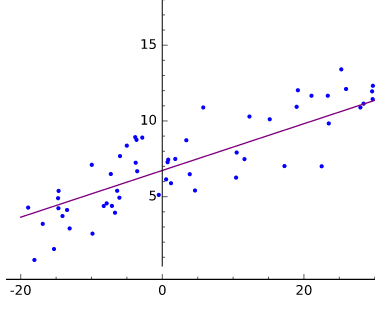
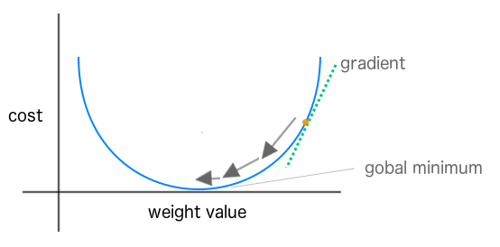

!SLIDE


#<font color="red">A</font><font color="blue">x</font> = <font color="green">b</font> Visually


 
!SLIDE


# Using Neural Networks

## Framing the Questions


* To build models we have to define
	* What is our training data (“evidence”)?
	* What kind of model (“hypothesis”) is appropriate for this data?
	* What kind of answer (“inference”) would we like to get from the model?
* These questions frame all machine learning workflows

!SLIDE

#  In neural networks we’re solving systems of (non-linear) equations of the form

# Move this up !!

# <font color="red">A</font><font color="blue">x</font> = <font color="green">b</font>

* <font color="red">A</font> matrix
	* This is our set of input data converted into an array of vectors
* <font color="blue">x</font> vector
	* The parameter vector of weights representing our model
* <font color="green">b</font> vector
	* Vector of output values or labels matching the rows  in the A matrix


!SLIDE

#<font color="red">A</font><font color="blue">x</font> = <font color="green">b</font> Visually


!SLIDE


# Recall Simplest Network

* <font color="red">A</font><font color="blue">x</font> = <font color="green">b</font>

* What was A?
* What was B?

!SLIDE

#Linear Algebra Terms

* Scalars
	- Elements in a vector
	- In compsci synonymous with the term “variable”
* Vectors
	* For a positive integer n, a vector is an n-tuple, ordered (multi)set, or array of n numbers, called elements or scalars
* Matricies
	* Group of vectors that have the same dimension (number of columns)

!SLIDE

#Solving Systems of Equations
* Two general methods
	* Direct method
	* Iterative methods
* Direct method
	* Fixed set of computation gives answer
	* Data fits in memory
	* Ex: Gaussian Elimination, Normal Equations
* Iterative methods
	* Converges after a series of steps
    * Stochastic Gradient Descent (SGD)

!SLIDE

* Overview
* Key terms
* Uses of Feed Forward Neural Networks
* **&rArr;** Output
* Training
* Inference
* Underfitting and Overfitting


!SLIDE

# Supervised vs Unsupervised Learning

# Move this to the what is machine learning section

* Supervised learning
  * We give the training process labels (“outputs”) for every training input data row
  * Model learns to associate input data with output value
* Unsupervised learning
  * No labels
  * Model attempts to learn structure in the data
* Neural Networks can be used for either supervised or unsupervised learning

!SLIDE

# Clustering

# Move this is well

* Typically unsupervised learning
	* “K-Means Clustering”
* Example
	* “cluster K groups of similar news articles together”
* ND4J supports this, but it is not  a NN

!SLIDE

# Supervised Learning "Framing the Question"

# REPEAT

* Determine
	* Output desired (“question to be answered”)
	* Input data to build model (“evidence”)
	* Appropriate model (“hypothesis”)
* Setup data in Ax = b form
	* For linear models and neural networks
* Then optimize the x parameter vector

!SLIDE

# Quick Statistics Review: Probability

# MOVE TO SOFTMAX, OR BINARY

* Probability
	* We define probability of an event E as a number always between 0 and 1
	* In this context the value 0 infers that the event E has no chance of occurring and the value 1 means that the event E is certain to occur
* The Canonical Coin Example
	* Fair coin flipped, looking for heads/tails (0.5 for each side)
	* Probability of sample space is always 1.0
	* P( Heads ) = 0.5 every time


!SLIDE

# Probability Distributions

# Put this with the Xavier section

* A specification of the stochastic structure of random variables
* In statistics we rely on making assumptions about how the data is distributed
	* To make inferences about the data
* We want a formula specifying how frequent values of observations in the distribution are
	* And how values can be taken by the points in the distribution


!SLIDE


# Classification

# Move up

* A type of answer we can get from a model
* Example:
	* “Is this an image of a cat or a dog?”
	* Binary classification
	* Classes: { cat, dog }
* Binary classification is where we have only 2 labels
	* Example: { positive, negative }
* Multi-Label Classification
	* N number of labels


!SLIDE


# Regression

# Move up

* Where we seek a continuous value output from the model
* Example: “predict the temperature for tomorrow”
	* Output: 75F
* Example: “predict price of house based on square footage”
	* Output: $250,000.00

!SLIDE


* Overview
* Key terms
* Uses of Feed Forward Neural Networks
* Output
* **&rArr;** Training
* Inference
* Underfitting and Overfitting


!SLIDE

# Training a Neural Net

## REPEAt KILL

* Input features passed in
* Output generated
* Error calculated
* Weights adjusted via backprop to decrease error


!SLIDE

# Training a Neural Net

* Inputs: Data you want to produce information from
* Connection weights and biases govern the activity of the network
* Learning algorithm changes weights and biases with each learning pass


!SLIDE

# Code Example: Train a network

## CLUMSY either need to wrap in context or kill it

```
for ( int n = 0; n < nEpochs; n++) {
            model.fit( #YourDataSetIterator# );
        }
```		

!SLIDE


# Fitting the Training Data

# Move this



!SLIDE

## move this 

# Optimization
* Iteratively adjust the values of the x parameter vector
	* Until we minimize the error in the model
* Error = prediction – actual
* Loss functions measure error
	* simple/common loss function: 
	* “mean squared error”
* How do we make choices about the next iterative “step”?
  * Where  “step” is how we change the x parameter vector


!SLIDE

# Move this

# Convex Optimization


!SLIDE
# Move this

#Gradient Descent
* Optimization method where we consider parameter space as
	* “hills of error”
	* Bottom of the loss curve is the most “accurate” spot for our parameter vector
* We start at one point on the curved error surface
	* Then compute a next step based on local information
* Typically we want to search in a downhill direction
	* So we compute the gradient
		* The derivative of the point in error-space
		* Gives us the slope of the curve

!SLIDE

# Move this
# Stochastic Gradient Descent
* With basic Gradient Descent we look at every training instance before computing a “next step”
* With SGD with compute a next step after every training instance
	* Sometimes we’ll do a mini-batch of instances


!SLIDE
# Move this
# SGD Visually Explained



