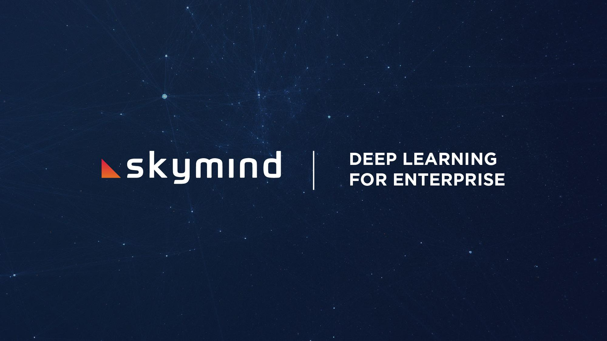

!SLIDE full-page center subsection

!SLIDE center subsection

# Welcome to the Course

!SLIDE

# This course is a Hands-ON 2 Day Course

* Outline

* Day 1:

	* Introduction to neural networks 
	* MLP
	* Convolutional
	* Recurrent
	* Choosing the appropriate neural network for time series data
	* Hands-on lab: Generating weather forecasts with a recurrent neural network

* Day 2:

* Configuring a data ingestion pipeline sequence data
* Recurrent neural nets for the prediction of medical outcomes
* Recurrent neural nets for the classification of sequence data
* Hands-on lab: Sequence classification with recurrent neural networks

~~~SECTION:notes~~~

# Tom patch this !!!

~~~ENDSECTION~~~

!SLIDE

# Schedule

* 9:00 AM Start
* 12:00 PM -> 1:00 PM Lunch
* Breaks 10 minutes each hour
* 5:00 PM Finish

!SLIDE

# Labs

* Java lab exercises using Intellij
* Separate Lab Document
  * LSTM for Character Sequence Generation
  * LSTM for Univariate Sequence Classification
  * Multivariate Time series Classification Physionet 
	  * (irregularly sampled + time features)
  * Multivariate Time Series Classification Physionet 
	  * (irregularly sampled, no time features)
  * Multivariate Time Series Classification Physionet 
	  * (resampled)

!SLIDE

# Contents

* Introduction
* What is Deep Learning
* Neural Network Demonstration
* Types of Neural Networks
* DeepLearning4J
* DeepLearning4J Overview
  * DataVec
  * DataVec Lab
  * ND4J and libnd4j
  * DeepLearning4J
  
  
~~~SECTION:notes~~~

# Update outline
Tom patch this !!!

~~~ENDSECTION~~~

!SLIDE

# Contents Continued...

* FeedForward Neural Networks Explained
* Abalone Lab
* Review of the Training Web UI
* Convolutional Neural Networks
* Convolutional Network Lab
* Modeling Sequences
* Data Ingest Case Study: Text
* Introduction to Recurrent Neural Networks
* LSTM Character Generation of Weather Forecast Lab
* Saving and Loading trained Models
* Lab: Saving and Loading trained Models

!SLIDE

# Introductions

* Intro to Skymind
* Instructor Intro
* Student Intro

!SLIDE full-page center subsection

!SLIDE

# Skymind

* Developer of DeepLearning4J
* Services
  * Support
  * Training

!SLIDE

# Symind Details

DeepLearning for the Enterprise

* RedHat for AI
* Custom Deep Learning Solutions for Enterprise Users
* Java focussed
* Production focussed rather than Research Focussed
* Stack operates natively with Big Data Infrastructure
  * Spark
  * Hadoop
  * Mesos
* CPU/GPU Execution
* Build, Customize and Maintain complete Deep Learning Stack

!SLIDE

# How is DeepLearning4J Used

* Customer Segments
  * Finance & Fraud (Financials, Banking)
  * Government (NASA JPL)
  * Telco
  * Retail 
* Notable Use Cases
  * Anomaly Detection (Fraud Detection, Network Intrusion, Predictive Maintenance)
  * Predictive Analytics (Demand Forecasting, Consumer Shopping Preferences)
  * Computer Vision (Digital Stamp Recognition, OCR, Image Classification)
  * Text Analytics (Chemical Compounds, FAA Part Document Versioning)

!SLIDE

# Introductions

* Why are you here?
* What do you want to learn?
* What sections interest you? 
* What is your background?

