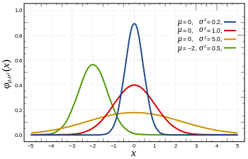

!SLIDE center subsection

# Weight Initialization

!SLIDE

# Why not initialize all weights to zero?

* Nodes would never diverge
  * All would learn the same thing

!SLIDE

# Solution

* Randomize weights
* Mean 0 + some randomized distribution

!SLIDE

# Probability Distributions

* A specification of the stochastic structure of random variables
* In statistics we rely on making assumptions about how the data is distributed
	* To make inferences about the data
* We want a formula specifying how frequent values of observations in the distribution are
	* And how values can be taken by the points in the distribution

!SLIDE

# Weight Initialization: The Challenge

* Weights too small
  * Signal shrinks as it passes through layers
  * Becomes too small to be useful
  * Vanishing Gradient Problem
* Weights too large
  * Signal Grows as it passes through Layers
  * Becomes to large to be useful
  * Exploding Gradient Problem

!SLIDE

# USeful Weight Distribution Techniques

* Truncated Normal
* Xavier
* Relu

!SLIDE

# Xavier Distribution

* Most Common
* 0 mean and a specific variance
  * Var(W)=1/nIn
 
~~~SECTION:notes~~~ 
where W is the initialization distribution for the neuron in question, 
and nIn is the number of neurons feeding into it. 
The distribution used is typically Gaussian or uniform.
~~~ENDSECTION~~~

!SLIDE 

# Benefits of Xavier

* Xavier Enabled Full Network Training vs per-Layer Pre-Training
* Big Breakthrough

~~~SECTION:notes~~~

Xavier initialization was one of the big enablers of the move away from per-layer generative pre-training.

~~~ENDSECTION~~~

!SLIDE

# Relu

* Relu 
* Works well with CNN's and Relu activations

