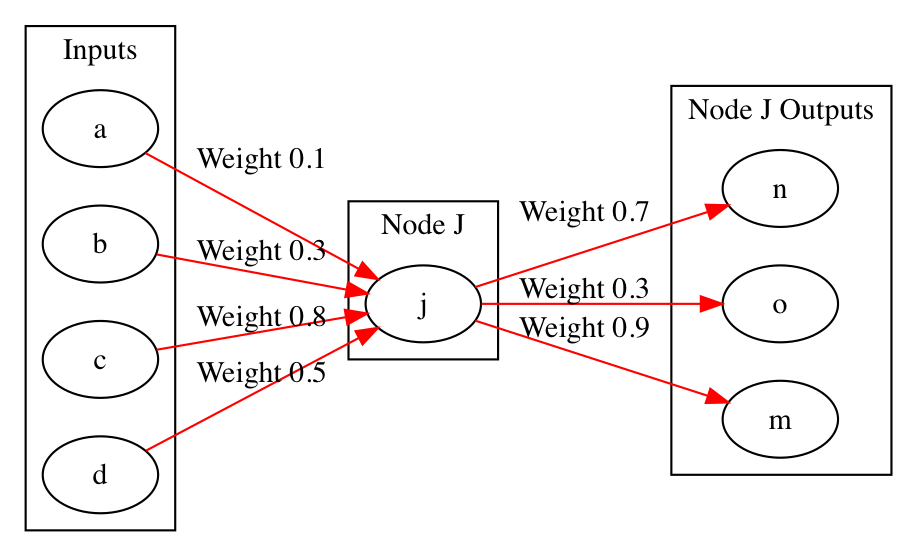
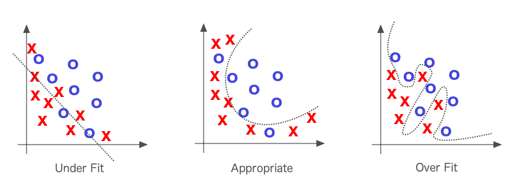
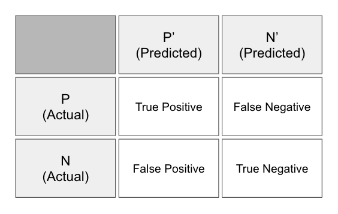

!SLIDE center subsection

# FeedForward Neural Networks Explained

!SLIDE

# FeedForward Neural Networks

* Share many features with Convolutional and Recurrent Neural Networks
* FeedForward neural networks ~ MultiLayerPerceptrons
* Developed in the 1940s-1960s

!SLIDE

# Why Deep Learning now

* Successful use came with the rise of GPUs and larger training sets

!SLIDE

# A FeedForward Neural Network

!SLIDE

# A Neural Network with Two Hidden Layers

!SLIDE

# Connections Between Nodes

* Designed to be selective and trainable
* Filter, aggregate, convert, amplify, ignore what they pass on to next neuron
* This transformation converts raw input into useful information
* Input has trainable weight applied
* Output determined by activation function

~~~SECTION:notes~~~

# ARI SAYS Kill this, maybe simplify

~~~ENDSECTION~~~

!SLIDE

# Neural Network Diagram Explained

* Node J

!SLIDE

# Single Node Diagram Discussion

* Input
  * Input is determined by the output of the input neurons * the weights applied to that output

* Weights
  * Assigned randomly* initially between 0-1
  * Weight of 0, input is ignored
  * Large weight input is amplified 
  * As the network trains weights are adjusted

* Output
	* Output is determined but it's input * weights, and the activation function. 
	* Sigmoid activation low input output 0 higher input output 1, in between S curve.
 	* ReLU low input 0 then linear after trigger. 

!SLIDE

# Key Terms

* Activation Function
  * A nonlinear A function that maps input on a nonlinear scale such as sigmoid or tanh. By definition, a nonlinear function’s output is not directly proportional to its input
* Loss Function
  * How error is calculated
* Weights
* BackProp

!SLIDE

# Neural Net Terms

* Weights
Connection Weights. Weights on connections in a neural network are coefficients that
scale (amplify or minimize) the input signal to a given neuron in the network

* Activation Function
  * The sigmoid function. "Its best thought of as a *squashing function*, because it takes the input and squashes it to be between zero and one: Very negative values are squashed towards zero and positive values get squashed towards one." Karpathy

!SLIDE

# Training a Neural Net

* Inputs: Data you want to produce information from
* Connection weights and biases govern the activity of the network
* Learning algorithm changes weights and biases with each learning pass

!SLIDE

# Underfitting and Overfitting
* Underfitting
	* Our model does not learn the structure of the training data well enough
	* Doesn’t perform on new data as well as it could
* Overfitting
  * Our model gives tremendous accuracy scores on training data
  * However, our model performs poorly on test data and other new data

!SLIDE

# Logistic Regression

* 3 parts to Logistic Regression Model
	* Hypothesis (logistic function): 
		* Gives us a prediction based on the parameter vector x and the input data features
	* Cost Function
		* Example: “max likelihood estimation”
		* Tells us how far off the prediction from the hypothesis is from the actual value
	* Update Function
		* Derivative of the cost function
		* Tells us what direction / how much of step to take

!SLIDE

# Evaluation and The Confusion Matrix

* Table representing
	* Predictions vs Actual Data
* We count these answers to get
	* True Positives
	*  False Positives
	* True Negatives
	* False Negatives
* Allows us to evaluate the model beyond “average accurate” percent
	* Can look at well a model can perform when it needs to be more than just “accurate a lot” 
	
!SLIDE

# Confusion Matrix
	

