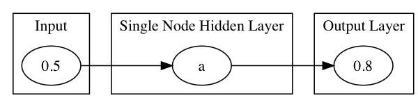
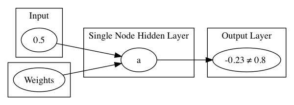

!SLIDE center subsection

# Simple Neural Network Introduction

This Section introduces Neural Networks starting with a very basic example

!SLIDE
# Simple Neural Network

* Simple Network Details
* Simple Network Lab
* Important Network Settings
* VGG-16 Demo

!SLIDE

# Simple Network

## The Goal: Input=0.5 Output=0.8

!SLIDE

# The Design: 
* Apply Random weights, plus activation function per neuron => output

* Test output: does -0.23 = 0.8 ?

!SLIDE

# Calculate error 

* backpropagate to adjust weights
* repeat

!SLIDE

#Output Layer of a Neural Network Can be Configured for Different Purposes: 

* MultiNomial
* Binary
* Continuous
* More...

!SLIDE

# Simple Network Settings

Simple Network  has Settings that will become familiar as they are used in all Neural Networks

* LearningRate
* Updater 
* Output Activation 
* Hidden Layer Activation 
* Number of Epochs 
* Loss Function

!SLIDE

# Extrapolate from Simple Network

* Simple Network took one value in and one value out and trained the network to learn the correct value 
* More complex data same process
* Input can be images, row data, documents
* Output can be T/F, range of values, labels of a class

~~~SECTION:notes~~~

# Sharpen the correlation from simple to complex

Multiple GPU support
• 4 x NVIDIA Titan, off-the-shelf workstation
• data parallelism for training and testing
• ~3.75 times speed-up, 2-3 weeks for training

~~~ENDSECTION~~~

!SLIDE

# Simple Network Lab

* See your Lab Manual

!SLIDE

# VGG-16 Demo

*  Instructor demonstration of a more complex Neural Network

!SLIDE

# Questions

Why do we do deep learning? 

Which requires Expert Feature Engineering? 

A. Deep Learning B.Machine Learning

~~~SECTION:notes~~~
Review Lab and add questions as appropriate

* What is the Learning Rate and what effect does it have on the Neural Network?
* Activation Function is set per Layer or for the whole Network?
* The error of the output compared to the expected output is? 
  A. Loss Function
  B. Sigmoid Function
  C. Learning Rate
* Stochastic Gradient Descent is an example of
  A. Updater
  B. Activation Function
  C. Loss Function

~~~ENDSECTION~~~

!SLIDE

