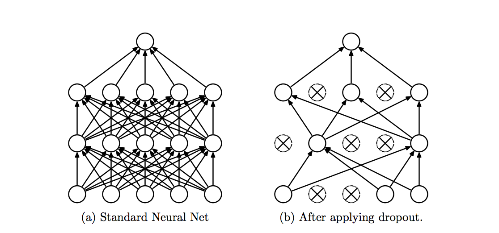

!SLIDE center subsection

# Tuning Neural Networks

!SLIDE

# Hyper-Parameters that may need tuning

* Learning Rate
* Batch Size
* Updater

!SLIDE

# Learning Rate Guidelines 

* 0.1 to 0.000001

!SLIDE

# Learning Rate

* Adaptive Learning Rate
* Adjust optimizer based on previous updates
  * Nesterovs Momentum
  * Adagrad, Adadelta, Adam,RMSPRop

!SLIDE

# Learning Rate Schedules

* Tune Learning Rate as Learning Progresses
* Based on Schedule or other metrics

!SLIDE

# Early Stopping

* Stop Training once overfitting is detected

!SLIDE

# Avoiding Overfitting

* What is Overfitting
  * Scores well on test
  * Scores poorly on unseen examples
* Has "memorized" training data
* Fails to generalize

!SLIDE

# Regularization

* l1 and l2 Regularization
  * penalizes large network weights 
  * avoids weights becoming too large
* Risks
  * Coefficients to high
  * Network stops learning
* Common values for l2 regularization
  * 1e-3 to 1e-6.

!SLIDE

# Dropout

* Set probability that a Neuron will be de-activated, set activation to 0
* Forces Network to learn different redundant representations
* Commonly used dropout rate of 0.5.

!SLIDE

# Dropout

~~~SECTION:notes~~~

 So, if you set half of the activations of a layer to zero, the neural network won’t be able to rely on particular activations in a given feed-forward pass during training. 
 
 As a consequence, the neural network will learn different, redundant representations; the network can’t rely on the particular neurons and the combination (or interaction) of these to be present. 
 
 Another nice side effect is that training will be faster.

~~~ENDSECTION~~~
