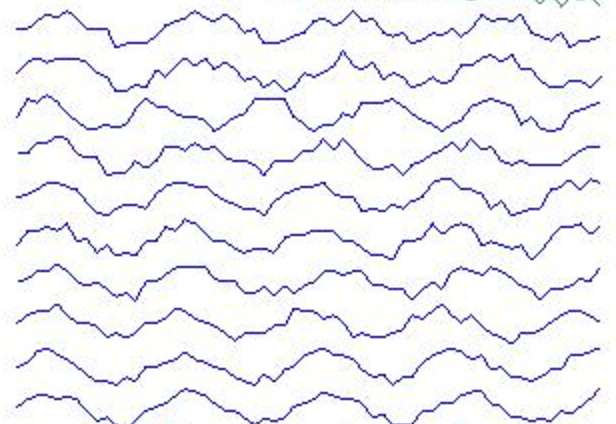
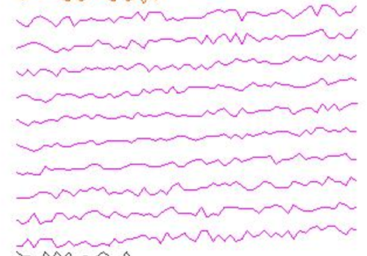

!SLIDE center subsection

# Classification of Univariate Time Series Using LSTM

!SLIDE

# The Data

* Source: University California at Irvine

~~~SECTION:notes~~~

 Tom patch this !!!

INSTRUCTOR NOTES LOOK LIKE THIS

~~~ENDSECTION~~~

!SLIDE

# The Data Represents signal data of 6 different type

!SLIDE

# Normal

!SLIDE

# Cyclic

!SLIDE

# Increasing trend

!SLIDE

# Decreasing trend

!SLIDE

# Upward shift

!SLIDE

# Downward shift

!SLIDE

# TODO: Describe how the data is stored
* Describe how the data is processed in DataVec

  
  
~~~SECTION:notes~~~

# Update outline
Tom patch this !!!

~~~ENDSECTION~~~

