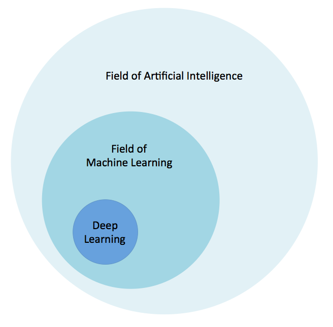

!SLIDE center subsection

# What is Deep Learning

This section describes the fields of Artificial Intelligence, Machine Learning and Deep Learning and how they are related.

!SLIDE 

# What is Deep Learning?

The relationship between Deep Learning and Machine Learning

* Machine Learning
* Data Science / Data Mining
* Deep Learning

!SLIDE

# Machine Learning

!SLIDE

# What is Machine Learning?

* A method of solving problems that can not easilly be solved through hand written code. Instead build a program that "learns" or adjusts itself to attain the correct answer. 
* A program that creates a program.
  
!SLIDE

# What is Machine Learning?

* Extracting Knowledge from raw data in the form of a model
  * Decision trees
  * Linear Models
  * Neural Networks

* Arthur Samuel quote:
  * "Field of study that gives computers the ability to learn without being explicitly programmed"
  

!SLIDE

# Why Machine Learning now? 

* Computing resources are getting cheaper and more powerful
* More data is available

!SLIDE

# A Diagram

~~~SECTION:notes~~~

Add knowledge rep for AI, pattern detection for Machine Learning, and for Deep Learning add Representational Learning

https://nudgr.io/blog/building-a-machine-learning-product-data-and-features/

Inspiration for this section
http://fortune.com/ai-artificial-intelligence-deep-machine-learning/

~~~ENDSECTION~~~

!SLIDE

# Machine Learning Compared to Data Science/Mining
* Data Mining
    * The process of extracting information from the data
    * Uses Machine Learning
* Data Science
  * Data Mining from the lens of a statistician
  * Venn Diagrams
  * A way to get a raise
  * A more agreeable Actuary
  * A statistician using a Mac

!SLIDE

# Machine Learning Examples

* Clustering
* Typically unsupervised learning
	* “K-Means Clustering”
* Example
	* “cluster K groups of similar news articles together”
* ND4J supports this, but it is not  a NN

!SLIDE

# Machine Learning Examples continued...

* Random Decision Forest
* Recommender Engines
* Bayesian Classification

!SLIDE

# A Definition of Deep Learning

* Deep learning (also known as deep structured learning, hierarchical learning or deep machine learning) is a branch of machine learning based on a set of algorithms that attempt to model high level abstractions in data.

source - wikipedia

!SLIDE

# Neural Networks

* A computational approach patterned on the human brain and nervous system

!SLIDE

# Comparison Between Neural Network  and Machine Learning

* Machine Learning
  * Hand Crafted Features
  * SME(Subject Matter Expert) is needed
  * Must inject Context
* Deep Learning/Neural Network
  * Automatic Feature Engineering
  * Learns Context

!SLIDE

# Biological Neurons

* Biological Neuron: An electrically excitable cell that processes and transmits information through electrical and chemical signals
* Biological Neural Network: An interconnected group of neurons

~~~SECTION:notes~~~

Add Picture

~~~ENDSECTION~~~

!SLIDE

# Biological Neuron

~~~SECTION:notes~~~

Add Picture
Wikimedia commons connected-neurons.jpg

~~~ENDSECTION~~~

!SLIDE

# Role of Artificial Neural Network

## Learns or Trains to perform tasks that traditional programming methods find rather challenging.
* Speech recognition 
* object recognition 
* computer vision 
* pattern recognition.

!SLIDE

# Supervised vs Unsupervised Learning

* Supervised learning
  * We give the training process labels (“outputs”) for every training input data row
  * Model learns to associate input data with output value
* Unsupervised learning
  * No labels
  * Model attempts to learn structure in the data
* Neural Networks can be used for either supervised or unsupervised learning

!SLIDE

# A Neural Network

!SLIDE

# DeepLearning Considerations

* Inspired by the brain
  * Very basic implementation
* Brain has huge number of Neurons
* Brain has non-linear connections
* Creates similar distributed units of functionality
* Knowledge comes through connections

!SLIDE

# The Rise and Fall of Neural Networks

* 40 year old theory and practice
* Hype cycle followed by delusion
* Repeat cycle
* Incremental improvements over time

!SLIDE

# Why Neural Networks Now? 

* 2012 Neural Network dominates image recognition
* Leads to current boom

