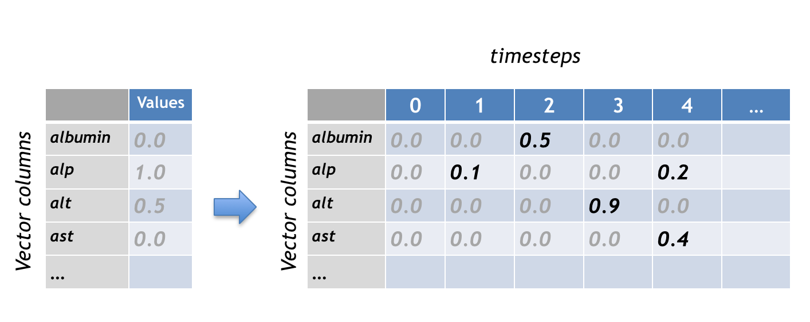

# Recurrent Neural Networks

# Table of Contents

This is Josh's stuff need to augment and rework and generalize

----------------------
# Recurrent neural networks

-------------------

# Recurrent neural networks

* Family of feedforward networks
	* Differ in how they send information over timesteps
* Allows for modeling change in vectors over time
	* Multiple sets of vectors as inputs
	* As opposed to a single input feature vector

-------------------

# Timeseries and Recurrent Networks

* When dealing with sequential or timeseries data
	* We prefer to apply Recurrent Networks
* Allows us to plug in how the data changes over time
	* Patient data collected periodically
	* State of power grid over time
	* Sequence of actions by customer

-------------------

# RNN Architectures

Add Captions somehow, or rebuild image

* Standard supervised learning
* Image Captioning
* Sentiment Analysis
* Video Captioning, Natural Language Translation
* Part of Speech Tagging
* Generative Mode for text

-------------------

# Example: PhysioNet Raw Data

* Set-a
	* Directory of single files
	* One file per patient
	* 48 hours of ICU data
* Format
	* Header Line
	* 6 Descriptor Values at 00:00 
	* Collected at Admission 
	* 37 Irregularly sampled columns
	* Over 48 hours

-------------------

# Physionet Data

Time,Parameter,Value
00:00,RecordID,132601
00:00,Age,74
00:00,Gender,1
00:00,Height,177.8
00:00,ICUType,2
00:00,Weight,75.9
00:15,pH,7.39
00:15,PaCO2,39
00:15,PaO2,137
00:56,pH,7.39
00:56,PaCO2,37
00:56,PaO2,222
01:26,Urine,250
01:26,Urine,635
01:31,DiasABP,70
01:31,FiO2,1
01:31,HR,103
01:31,MAP,94
01:31,MechVent,1
01:31,SysABP,154
01:34,HCT,24.9
01:34,Platelets,115
01:34,WBC,16.4
01:41,DiasABP,52
01:41,HR,102
01:41,MAP,65
01:41,SysABP,95
01:56,DiasABP,64
01:56,GCS,3
01:56,HR,104
01:56,MAP,85
01:56,SysABP,132
…

-------------------

# Preparing Input Data

* Input was 3D Tensor (3d Matrix)
	* Mini-batch as first dimension
	* Feature Columns as second dimension
	* Timesteps as third dimension
* PhysioNet: Mini-batch size of 20, 43 columns, and 202 Timesteps
	* We have 173,720 values per Tensor input

TH- explain batch and minibatch in terms of training

-------------------

# Input Sequence

* A single training example gets the added dimension of timesteps per column

-------------------

-------------------

# Recurrent Networks For Classification

* This is the “many-to-one” setup
	* Traditionally we’d do hand coded feature extraction on timeseries and encode into a vector
		* Losing the time aspect to the data
	* The “many”-part allows us to input a sequence without losing the time domain aspect
* Input is a series of measurements aligned by timestep
	* 0,1,0,0
	* 1,0,1,1
* Output in this case is a classification
	* Example: “Fraud vs Normal transaction”

-------------------

# Sequence Classification with RNNs

* Recurrent Neural Networks have the ability to <i>model change of input over time</i>
* Older techniques (mostly) do not retain time domain
	* Hidden Markov Models do…
		* <i>but are more limited</i>
* Key Takeaway: 
	* For working with Timeseries data, RNNs will be more accurate

-------------------

