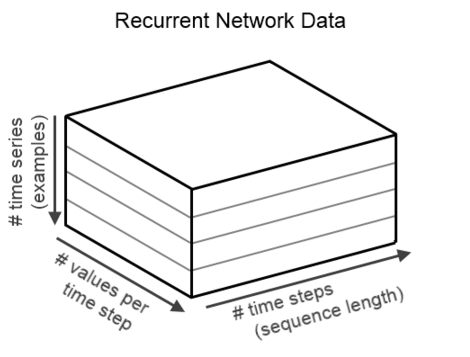

# Building recurrent neural network applications


# Table of Contents

1. Goals of the DeepLearning4J project
2. Parts of the DeepLearning4J project
3. DataVec
4. ND4J
5. DL4J


<div style="page-break-after: always;"></div>
----------------------

# Building recurrent neural network applications


-------------------
<div style="page-break-after: always;"></div>

# Overview 

* Basics of Building RNN Input
* Building Input for Local Training
* Building Input for Spark Training
* Model Architecture, Training, and Evaluation

-------------------
<div style="page-break-after: always;"></div>

# Goal: Model Sensor Data with RNN

-------------------
<div style="page-break-after: always;"></div>

# Where is data?

* What format is data in?
	* Leverage ideas from Wednesday’s last unit on ETL!
	* Convert raw data to DataSet
* Setup a RNN Model
	* Architecture
* Executing training
	* Local
	* Spark

-------------------
<div style="page-break-after: always;"></div>

# Basics of RNN Input

-------------------
<div style="page-break-after: always;"></div>

# From Raw Input to NDArrays

* Raw Input 

|0|	1|	2|	3|	4|	…|
|---|---|---|---|---|---|
|albumin|0.0|0.0|0.5|0.0|0.0|	
|alp|0.0|0.1|0.0|0.0|0.2|	
|alt|0.0|0.0|0.0|0.9|0.0|	
|ast|0.0|0.0|0.0|0.0|0.4|							


-------------------
<div style="page-break-after: always;"></div>

# From Raw Input to NDArrays

* NDArray
 

-------------------
<div style="page-break-after: always;"></div>

# Question

* Given a data set with two values
	* Temperature taken 1 per hour
	* Total precipitation taken once a day at hour 24
* Describe the data format
	* How many data points in a days worth of data
	* What if temp was taken every minute?

-------------------
<div style="page-break-after: always;"></div>

# Key DataSet Vectorization Questions

* How is the input data laid out?
	* File format?
	* Single or Multiple Files?
	* How many columns per sensor?
	* Where are the labels located?

-------------------
<div style="page-break-after: always;"></div>

# File Format

* Generally text input format
* If not text, may need a custom input format


-------------------
<div style="page-break-after: always;"></div>

# Single or Multiple Files?

* Timeseries readings in a single file
	* “each line is a CSV set of readings from a single sensor”
	* “each line is a sentence”
* Timeseries readings in multiple files
	* “each file represents readings from a single sensor”


-------------------
<div style="page-break-after: always;"></div>

# Columns per Sensor

* How many different types of readings are being taken per source?
	* Example of single: “voltage”
		* 1 column
	* Example of multiple: “voltage” and “temperature”
	  * 2 columns


-------------------
<div style="page-break-after: always;"></div>

# Preparing Input Data: Tensors


* Input was 3D Tensor (3d Matrix)
	* Mini-batch as first dimension
	* Feature Columns as second dimension
	* Timesteps as third dimension
* Goal: produce a DataSet object
	* Containing vectorized input data


-------------------
<div style="page-break-after: always;"></div>

# A Single Training Example

A single training example gets the added dimension of timesteps per column

| |Values|
|---|---|
|albumin|0.0|
|alp|1.0|
|alt|0.5|
|ast|0.0|
|...|  |

TimeSteps

|  |0|1|2|3|4|....|
|---|---|---|---|---|---|---|
|albumin|0.0|0.0|0.5|0.0|0.0|...|
|alp|0.0|0.1|0.0|0.0|0.2|...|
|alt|0.0|0.0|0.0|0.9|0.0|...|
|ast|0.0|0.0|0.0|0.0|0.4|...|
|...|...|...|...|...|...|...|


-------------------
<div style="page-break-after: always;"></div>

# Creating RNN DataSets

* D = new DataSet(input, labels, mask, mask2)
* Input
	* INDArray input  = Nd4j.zeros(new int[]{ miniBatchSize, INPUTColumnCount, timesteps });
* Labels
	* INDArray labels = Nd4j.zeros(new int[]{ miniBatchSize, OUTPUTColumnCount, timesteps });
* Mask
	* Nd4j.zeros(new int[]{ miniBatchSize, timesteps });
* Mask2
	* (Same as mask)


-------------------
<div style="page-break-after: always;"></div>

# Masking

* Masks used for training data and labels
	* We set the mask timestep value to 1.0 for every timestep containing training data
	* We set the mask timestep value to 0.0 for all other timesteps


-------------------
<div style="page-break-after: always;"></div>

# High-Level Code: Building DataSets

* Typically we want to loop across the timesteps in the outer loop
* For each timestep
	* Set the relevant columns to the values
	* INDArray.setScalar( col, timestep, value )
* This will loop through input vectorized data
	* Merge it into a row in a timestep


-------------------
<div style="page-break-after: always;"></div>

# Building Tensors with NDArrays

* When setting values for a single record
	* INDArray.putScalar( vectorColumn, timestepIndex, value )
* When setting values for a record in a mini-batch
	* INDArray.putScalar( miniBatchIndex, vectorColumn, timestepIndex, value )


-------------------
<div style="page-break-after: always;"></div>

### Building Sequential Tensor input for 
# Local Training


-------------------
<div style="page-break-after: always;"></div>

# Goal: DataSet from Local Raw Data

* Need to be able to load the raw data
	* Read the file format
	* Match up labels to features
	* Perform any normalization during vectorization
* If the input file matches a record reader
	* We can leverage that code to build our NDArrays and DataSets
* If not, we need to write custom code
	*  to build the DataSet objects


-------------------
<div style="page-break-after: always;"></div>

# Local Code Example

```
//Note that we have 450 training files for features: train/features/0.csv through train/features/449.csv
SequenceRecordReader trainFeatures = new CSVSequenceRecordReader();
trainFeatures.initialize(new NumberedFileInputSplit(featuresDirTrain.getAbsolutePath() + "/%d.csv", 0, 449));
SequenceRecordReader trainLabels = new CSVSequenceRecordReader();
trainLabels.initialize(new NumberedFileInputSplit(labelsDirTrain.getAbsolutePath() + "/%d.csv", 0, 449));

int miniBatchSize = 10;
int numLabelClasses = 6;
DataSetIterator trainData = new SequenceRecordReaderDataSetIterator(trainFeatures, trainLabels, miniBatchSize, numLabelClasses,
    false, SequenceRecordReaderDataSetIterator.AlignmentMode.ALIGN_END);

//Normalize the training data
DataNormalization normalizer = new NormalizerStandardize();
normalizer.fit(trainData);              //Collect training data statistics
trainData.reset();

//Use previously collected statistics to normalize on-the-fly. Each DataSet returned by 'trainData' iterator will be normalized
trainData.setPreProcessor(normalizer);
```


-------------------
<div style="page-break-after: always;"></div>

# High-Level Pattern

* Load data from File:
	* <b>SequenceRecordReader</b> subclass
* Dealing with file format:
	* <b>InputSplit</b> subclass
* We handle raw sequence data to DataSet (tensor) conversion with:
	* <b>SequenceRecordReaderDataSetIterator</b>
	* Also works with <b>DataNormalization</b> object

-------------------
<div style="page-break-after: always;"></div>

### Building Tensor Input for
# Spark Training


-------------------
<div style="page-break-after: always;"></div>

# Representing Timeseries with Spark

* First goal: Load data from Disk
	* RDD<List<Writable>> 
		* can't represent sequence data... 
	* RDD<List<List<Writable>>> 
		* Allows us to represent collections of timeseries
* Second Goal: convert to DataSet
	* RDD<List<List<Writable>>> becomes
		* RDD<DataSet>


-------------------
<div style="page-break-after: always;"></div>

# High-Level Pattern: Spark

* Load data from File:
	* Use the spark context to load the raw data into RDDs
	* Have to consider loading data from a single file vs multiple files in choosing methods
	* Produces a RDD<String> or RDD<String, String>
* Dealing with file format:
	* Assuming HDFS as storage
		* Use Hadoop input formats with Spark
* We handle raw sequence data to DataSet (tensor) conversion with:
	* Custom class:
		* implements Function<String, DataSet>

-------------------
<div style="page-break-after: always;"></div>

# Load Data From HDFS

* Use Input formats from Hadoop
	* CSV Files: TextInputFormat (default)
* Loading from a single file
	* JavaRDD<String> trainingRecordCSVLines = sc.textFile( pathData );
* Loading Data from multiple files
	* JavaPairRDD<String, String> linesTR = sc.wholeTextFiles( … )


-------------------
<div style="page-break-after: always;"></div>

# Writing Custom Timeseries to DataSet Converter

* Implements method:
	* public DataSet call(String s) throws Exception {
* Creates 2D dataset for Features (NDArray)
	* Columns x timesteps
	* (Input)
* Create labels NDArray
	* (Output)
* Map both NDArrays together in a DataSet object
	* { Input -> Output }


-------------------
<div style="page-break-after: always;"></div>

# Custom Converter Code Example

```
@Override
public DataSet call(String s) throws Exception {

    recordReader.initialize(new StringSplit(s));
    List<Writable> lw = recordReader.next();
    
    int inputColumnCount = 1;
    int outputColumnCount = this.numOutComes;
    int maxTimestepLength = lw.size() - 1;
    
	INDArray input  = Nd4j.zeros(new int[]{ 1, inputColumnCount, maxTimestepLength });
	INDArray labels = Nd4j.zeros(new int[]{ 1, outputColumnCount, maxTimestepLength });
	INDArray mask   = Nd4j.zeros(new int[]{ 1, maxTimestepLength });
	INDArray mask2 = Nd4j.zeros(new int[]{ 1, maxTimestepLength });

	int csvIndex = 0;
	
	// TODO: probably should account for a label index other that index 0...
	for ( int timestepIndex = 0; timestepIndex < maxTimestepLength; timestepIndex++ ) {
		
		// set the features
		input.putScalar( new int[]{ 0, 0, timestepIndex }, lw.get( csvIndex + 1 ).toDouble() );
		
		// set the mask
		mask.putScalar(new int[]{ 0, timestepIndex }, 1.0);

		// set the label for every timestep at the class column
		labels.putScalar(new int[]{ 0, lw.get( 0 ).toInt() - 1, timestepIndex }, 1.0);
		
		csvIndex++;
			
		
	}
	
	
	Nd4j.copy(mask, mask2);
	
	return new DataSet(input,labels, mask, mask2);
}
```


-------------------
<div style="page-break-after: always;"></div>

# Code: Converting RDD<L<L<W>>>

```
// convert raw data into sequence
JavaRDD<List<List<Writable>>> timeseries_ETLd = executor.executeToSequence(parsed, tp);

…

// data cleanup transform (optional)
JavaRDD<List<List<Writable>>> vectorizedTimeseriesResult = executor.executeSequenceToSequence(timeseries_ETLd, tpVectorize);

...

// now convert to DataSet for modeling
JavaRDD<DataSet> timeseriesDataSet = vectorizedTimeseriesResult.map( 
new DataVecSequenceDataSetFunction( 0, 2, false, null, null ) );
```


-------------------
<div style="page-break-after: always;"></div>

# Spark Timeseries Normalization

* NormalizerStandardize and NormalizerMinMaxScaler handle time series
	* e.g., mean/stdev etc are over all time steps, not independent for each, etc


-------------------
<div style="page-break-after: always;"></div>

# Rnn Model Architecture, training, and evaluation 


-------------------
<div style="page-break-after: always;"></div>

# Common RNN Model Architecture

```
MultiLayerConfiguration conf = new NeuralNetConfiguration.Builder()
                .seed(123)
                .optimizationAlgo(OptimizationAlgorithm.STOCHASTIC_GRADIENT_DESCENT).iterations(1)
                .weightInit(WeightInit.XAVIER)
                .updater(Updater.NESTEROVS).momentum(0.9)
                .learningRate(0.005)
                .gradientNormalization(GradientNormalization.ClipElementWiseAbsoluteValue)
                .gradientNormalizationThreshold(0.5)
                .list()
                .layer(0, new GravesLSTM.Builder().activation("tanh").nIn(1).nOut(10).build())
                .layer(1, new RnnOutputLayer.Builder(LossFunctions.LossFunction.MCXENT)
                        .activation("softmax").nIn(10).nOut(numLabelClasses).build())
                .pretrain(false).backprop(true).build();

        MultiLayerNetwork net = new MultiLayerNetwork(conf);
        net.init();
```		


-------------------
<div style="page-break-after: always;"></div>

# Model Training and Evaluation

```
int nEpochs = 40;
String str = "Test set evaluation at epoch %d: Accuracy = %.2f, F1 = %.2f";
for (int i = 0; i < nEpochs; i++) {
    net.fit(trainData);
    Evaluation evaluation = net.evaluate(testData);
    log.info(String.format(str, i, evaluation.accuracy(), evaluation.f1()));
    testData.reset();
    trainData.reset();
}
log.info("----- Example Complete -----");
```


-------------------
<div style="page-break-after: always;"></div>


